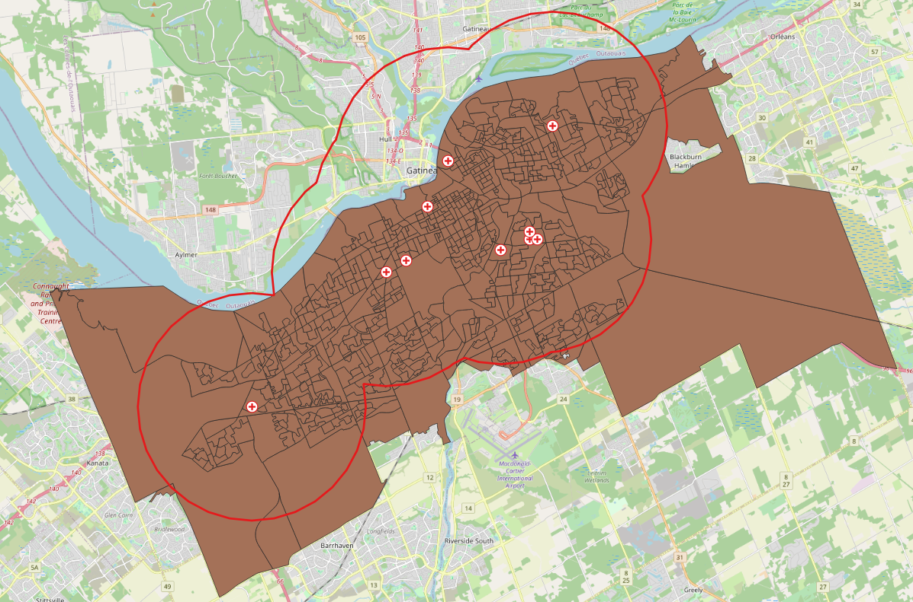
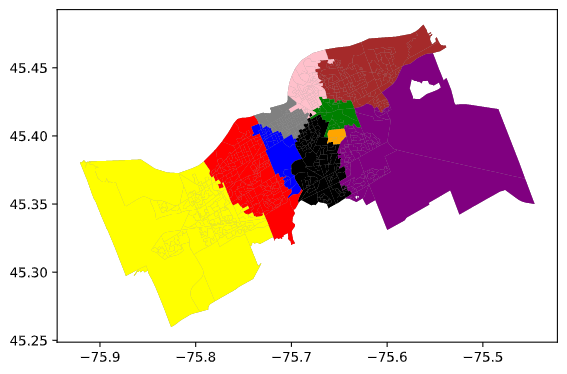
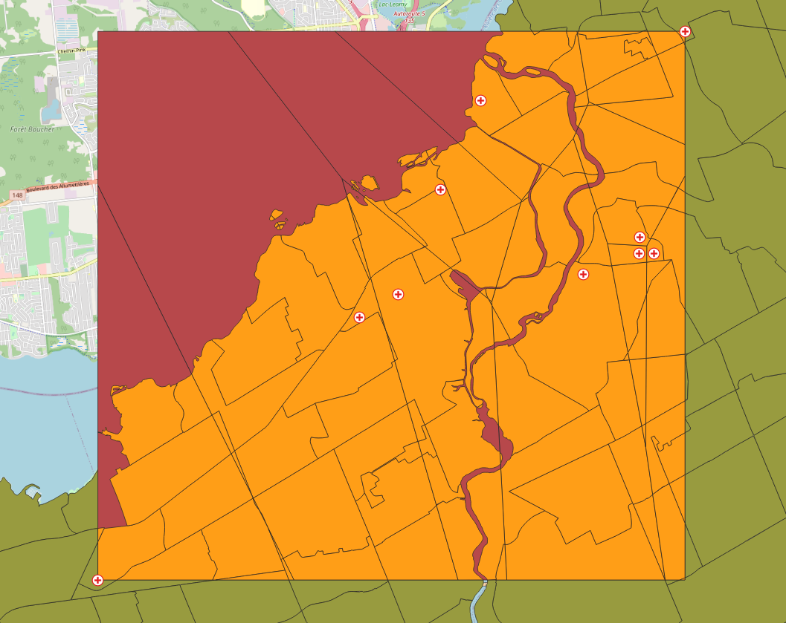
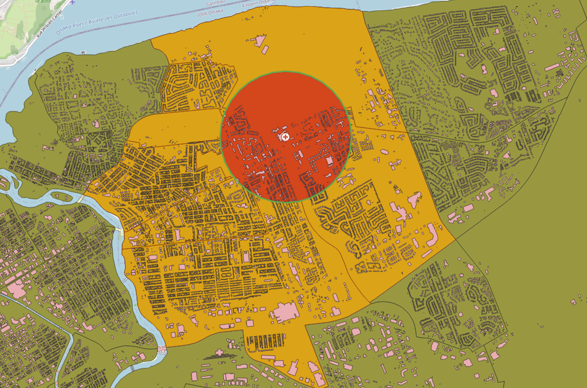
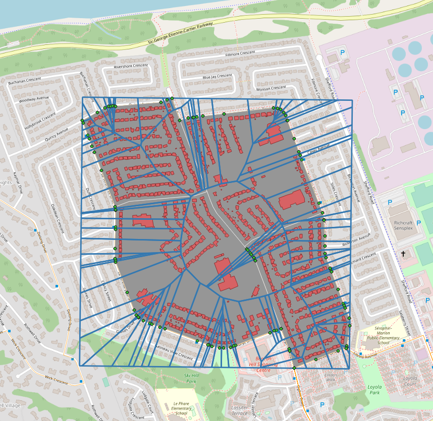

# Spatial Analysis Scenarios

This repository explores various open sources tools one could use for performing geospatial analysis. There are interactive **Jupyter Notebooks** available for demo purposes via **Binder**. Developers can also install Python packages themselves and run the code on their own in **Spyder**. The goal is to discover approaches one could use for coupling between simulation models. 

Example scenarios will fall into one or more of the following categories:
- Spatial Join
  - Intersect, Contains, Within, etc. 
- Topological
  - A topology is...to be cont'd
  - [Voronoi diagrams embody a form of "automated" topology](http://citeseerx.ist.psu.edu/viewdoc/download?doi=10.1.1.86.3356&rep=rep1&type=pdf)
- Geostatistical 
  - Geostatistics is...to be cont'd
- Attribute Query
  - Attribute queries are...to be cont'd
- Distance
  - Something...
- Network Analysis
  - Roads, busses, etc...to be cont'd

## Demo Notebook Scenarios

[](https://mybinder.org/v2/gh/omarkawach/spatial_analysis_scenarios.git/master)

Steps:
- Click the icon above to launch this repository in Jupyter Notebook
- Once Binder loads the repo in Jupyter Notebook, Select the `scenario_notebooks` folder
- Select any notebook to demo
- Set kernel to Python 3
- Click `Run` to move down one cell
  - Keep clicking `Run` to move down another cell

**Note:** Some cells may need more than a few seconds or minutes to run. 

## Development Setup
1. In a console, cd into your desired directory and run the following:
   
   `git clone https://github.com/omarkawach/spatial_analysis_scenarios.git`
   
2. [Download Anaconda and then launch Spyder](https://www.anaconda.com/products/individual)
   

3. Open a console where you cloned the repo, install all necessary python packages in one go using:
   
   ` pip install --use-feature=2020-resolver -r packages.txt `

4. You may now run/manipulate code

## Dataset Sources

**[Ottawa Neighbourhood Study (ONS) from Carleton University](https://library.carleton.ca/find/gis/geospatial-data/ottawa-neighbourhoods)**

*Description from source:*
```
The ONS Neighbourhood Boundaries were created by the Ottawa Neighbourhood Study
(ONS) to analyse population statistics and are not indicative of actual 
neighbourhood limits.  Neighbourhood refers to an inhabited area delineated by 
social and physical boundaries. ONS neighbourhood boundaries were derived based on 
census tracts, physical and demographic similarities, physical barriers (e.g. 
waterways, highways, etc.), maps used by the real estate profession (e.g. the 
Ottawa Multiple Listing Service), consultations with community stakeholders, as 
well as fieldwork by ONS researchers.

108 neighbourhood boundaries are included in the shapefile, 
from Barrhaven to Woodvale. 
```

**[Hospitals from Open Ottawa](https://open.ottawa.ca/datasets/b769ce497f2540aa962e602c983994d6_0?geometry=-76.050%2C45.348%2C-75.396%2C45.433)**

*Shapefile Location*

See [`/shapefiles/OttawaHospitals`](https://github.com/omarkawach/spatial_analysis_scenarios/tree/master/shapefiles/OttawaHospitals)

*Description from source:*
```
Map containing point features of Hospitals located in the City of Ottawa.
```

**[Open Database of Building from Statistics Canada](https://www.statcan.gc.ca/eng/lode/databases/odb)**

*Shapefile Location*

See [`/shapefiles/OttawaBuildings.zip`](https://github.com/omarkawach/spatial_analysis_scenarios/tree/master/shapefiles/OttawaBuildings.zip)

*Description from source:*

```
The Open Database of Buildings (ODB) is a collection of open data on buildings,
primarily building footprints, and is made available under the Open Government 
License - Canada.
```

**[Ottawa Dissemination Areas (DA) from Open Ottawa](https://open.ottawa.ca/datasets/89fe8cb18d7345b2b666623ccb872310_0?geometry=-78.333%2C44.878%2C-73.101%2C45.555)**

*Shapefile Location*

See [`/shapefiles/OttawaDA`](https://github.com/omarkawach/spatial_analysis_scenarios/tree/master/shapefiles/OttawaDA)

*Description from source:*

```
The Dissemination Area Boundary Files portray the dissemination area boundaries
for which Census data are disseminated. A dissemination area is a small area
composed of one or more neighbouring dissemination blocks and is the smallest
standard geographic area for which all census data are disseminated.
```

**[OC Transpo Routes from Carleton University](https://library.carleton.ca/find/gis/geospatial-data/oc-transpo-transit-routes)**

*Shapefile Location*

See [`/shapefiles/OC_TRANSPO_ROUTES`](https://github.com/omarkawach/spatial_analysis_scenarios/tree/master/shapefiles/OC_TRANSPO_ROUTES)

*Modifications to Original Dataset in this Repo:*

The dataset came with hundreds of shapefiles. All the shapefiles were merged into one. 

*Description from source:*

```
Individual vector transit routes for OC Transpo between 1929 and 2015. 

The following information was collected for each transit route:
- Route Number
- Route Type (Regular, Peak, Express, Rural, etc.)
- Mode of Transportation (bus, train)
- Year
```


**[Road Network Files from Statistics Canada](https://www12.statcan.gc.ca/census-recensement/2011/geo/RNF-FRR/index-eng.cfm)**

*Shapefile Location*

See [`/shapefiles/OttawaRoads`](https://github.com/omarkawach/spatial_analysis_scenarios/tree/master/shapefiles/OttawaRoads)

*Description from source:*

```
Road network files are digital representations of Canada's
national road network, containing information such as street
names, types, directions and address ranges.
```

## Scenarios

### Spatial Joining Buildings to Locations v1.0
*Context* 

Mary requires regular visits to the hospitals, and is looking for a new apartment to rent. Mary would like her apartment to be located in a ONS polygon with a hospital in it. 

*Results*


**Figure 1**. 10 ONS polygons with Hospitals in them

```
Where Mary can look for a new apartment:
- Civic Hospital-Central Park
- Billings Bridge - Alta Vista
- Riverview
- Wateridge Village
- Qualicum - Redwood Park
- West Centretown
- Byward Market
```

*Files Used*
- Shapefile from [`spatial_analysis_scenarios/shapefiles/ONS`](https://github.com/omarkawach/spatial_analysis_scenarios/tree/master/shapefiles/ONS)
- Shapefile from [`spatial_analysis_scenarios/shapefiles/OttawaHospitals`](https://github.com/omarkawach/spatial_analysis_scenarios/tree/master/shapefiles/OttawaHospitals)

*Python Packages Used*
- GeoPandas
  - To read shapefiles
- Matplotlib
  - To plot data

*Potential Use Case*
1. Link a hydro plant to a number of ONS polygons


### Distance-based Logistics Study v1.0

*Context*

For dispatching ambulances, 9-11 Operators want to know which hospitals are closest to a caller's DA.

*Results*



**Figure 2**. Ottawa DAs Intersecting with 5km Hospital Buffer (Dissolved)

**Legend**




**Figure 3**. Ottawa DAs with the Closest Hospital 

*Files Used*

- Shapefile from [`spatial_analysis_scenarios/shapefiles/OttawaDA_nearHospital`](https://github.com/omarkawach/spatial_analysis_scenarios/tree/master/shapefiles/OttawaDA_nearHospital)
  - This was originally the shapefile from [`spatial_analysis_scenarios/shapefiles/OttawaDA`](https://github.com/omarkawach/spatial_analysis_scenarios/tree/master/shapefiles/OttawaDA) but then it was modified in QGIS to only hold polygons that intersect within a 5km buffer of all the hospitals (see figure 2)
- Shapefile from [`spatial_analysis_scenarios/shapefiles/OttawaHospitals`](https://github.com/omarkawach/spatial_analysis_scenarios/tree/master/shapefiles/OttawaHospitals)

*Python Packages Used*
  - GeoPandas
    - To read shapefiles
  - Matplotlib
    - To plot data
  - Shapely
    - To create GeoSeries' for calculating distances 
  - PyProj
    - To change the espg of shapefiles

*Possible Use Case*
1. During a pandemic, we don't want to overwhelm hospitals. 
   - Only allow patients into a hospital if they're from a specific ONS polygon
      - Number of accepted ONS polygons for a hospital could be based on population, number of buildings, etc.

### Logistical Study using Network Analysis v1.0

*Context*

We're in the center of Ottawa and want to find the shortest path to a road crossing. 

*Result*


**Figure 3**. Shortest path

*Python Packages Used*
  - GeoPandas: To create GeoDataFrames
  - PyProj: To change the espg of GeoDataFrames
  - Pandas: Convert dictionary to a Panda Series
  - OSMnx: For graphing and statistics
  - NetworkX: To calculate the shortest path

*Potential Use Case*
1. Find shortest path from warehouse to multiple stores 
2. Link distribution centers to population centers
3. An app used for delivering groceries wants to know which Walmart to get groceries from since there are multiple in the customer's area. This scenario would find the shortest path between the customers house and the Walmarts. 


### Building a Topology using Spatial Weights v1.0

For the ONS dataset, we are looking for ways to represent the spatial relationships between polygons. We do this by depicting a spatial weight network (planar). In this case, the Queen contiguity weight lets us look at shared edges or vertices between polygons. 

*Result*


**Figure 4**. Spatial Weight Network Ottawa

*File used*
- Shapefile from [`spatial_analysis_scenarios/shapefiles/ONS`](https://github.com/omarkawach/spatial_analysis_scenarios/tree/master/shapefiles/ONS)

*Python Packages used*
  - GeoPandas: To read shapefiles
  - PySal: To calculate and plot spatial weights

*Potential Use Case*
1. [Boundary Detection](https://geographicdata.science/book/notebooks/04_spatial_weights.html) to observe differences in wealth (Spatial Econometrics)


### Geostatistical Study on Population Density v1.0
*Context*

Conduct a population density study using ONS data and then define new neighbourhoods based on quartile classification algorithm.

*Result*


**Figure 4**. ONS Population Density

**Legend**


**Figure 5**. ONS Quartile Classification for New Neighbourhoods

*Data Used*
- Shapefile from [`spatial_analysis_scenarios/shapefiles/ONS`](https://github.com/omarkawach/spatial_analysis_scenarios/tree/master/shapefiles/ONS)

*Python Packages Used*
- GeoPandas
  - To read shapefiles
- Matplotlib
  - To plot data
- NumPy
  - To help with classification

*Potential Use Case*
1. Model highly infectious populations according to population density
   - We may theorize that more dense areas play an impact on the number of cases in neighbouring polygons. 
   - Expand to have topological relationships 
     - Maybe have buffers based on infection spread


### Voronoi Diagrams for Proximity Studies v1.0

*Context*

Let's say you have a bunch of neighbourhoods and hospitals as point data. You could build voronoi regions using the hospitals, then intersect them with neighbourhoods to identify all the neighbourhoods closest to each hospital. 

*Results*



**Figure 6**. ONS Closest to Hospitals


**Figure 7**. Peview of Attribute Table for Figure 6

*Files Used*
- Shapefile from [`spatial_analysis_scenarios/shapefiles/ONS`](https://github.com/omarkawach/spatial_analysis_scenarios/tree/master/shapefiles/ONS)
- Shapefile from [`spatial_analysis_scenarios/shapefiles/OttawaHospitals`](https://github.com/omarkawach/spatial_analysis_scenarios/tree/master/shapefiles/OttawaHospitals)


### Topological Study for Emergency Preparedness v1.0
*Context*

The Montfort Hospital has had a chemical spill. Residents whose ONS boundary intersect within 1km of the hospital are warned to evacuate. First Responders want to know how many buildings are affected so that they may act by priority. 

*Results*



**Figure 8**. Overview of Chemical Spill Scenario


**Figure 9**. Number of Buildings Directly Impacted within 1km Buffer


**Figure 10**. Number of Buildings Impacted by ONS Polygon

*Data Used*

- Shapefile from [`spatial_analysis_scenarios/shapefiles/ONS`](https://github.com/omarkawach/spatial_analysis_scenarios/tree/master/shapefiles/ONS)
  - Based on the buffer intersection, the shapefile was modified into [`spatial_analysis_scenarios/shapefiles/Chemical_Spill_ONS`](https://github.com/omarkawach/spatial_analysis_scenarios/tree/master/shapefiles/Chemical_Spill_ONS)
- Shapefile from [`spatial_analysis_scenarios/shapefiles/OttawaHospitals`](https://github.com/omarkawach/spatial_analysis_scenarios/tree/master/shapefiles/ONS)
- Shapefile from [`spatial_analysis_scenarios/shapefiles/OttawaBuildings`](https://github.com/omarkawach/spatial_analysis_scenarios/tree/master/shapefiles/ONS)

*QGIS Plugin Used*
- MMQGIS Plugin is convenient for creating buffers

*Possible Use Cases*
1. Go further and evacuate neighbourhoods that are touching impacted neighbourhoods. 
2. Be better prepared for potential future events like the [Lac-Mégantic rail disaster](https://www.tsb.gc.ca/eng/rapports-reports/rail/2013/r13d0054/r13d0054-r-es.html)
   - Help dispatch and evacuate people. 
3. Unrelated to emergencies, we could see which buildings are in a DA and connect them for population growth analysis.


### Voronoi Diagrams for Proximity Studies v1.1

*Context*

Find the nearest bus stop to each building within specific Ottawa DAs. This can be done by using bus stops to create voronoi polygons. Then, intersect the voronoi polygons with the Ottawa DAs. This scenario assumes that the vertices from each bus route are bus stops, even if that is not the case.  

*Result*



**Figure 8**. Overview of Closest Bus Stop(s) to each Building in DAs

*Files Used*

- Shapefile from [`spatial_analysis_scenarios/shapefiles/Four_DAUIDs`](https://github.com/omarkawach/spatial_analysis_scenarios/tree/master/shapefiles/Four_DAUIDs) which is a modified version of [`spatial_analysis_scenarios/shapefiles/OttawaDA`](https://github.com/omarkawach/spatial_analysis_scenarios/tree/master/shapefiles/OttawaDA)
- Shapefile from [`spatial_analysis_scenarios/shapefiles/OC_ROUTES_DAUID_VERTICES`](https://github.com/omarkawach/spatial_analysis_scenarios/tree/master/shapefiles/OC_ROUTES_DAUID_VERTICES) which is a modified version of [`spatial_analysis_scenarios/shapefiles/OC_TRANSPO_ROUTES`](https://github.com/omarkawach/spatial_analysis_scenarios/tree/master/shapefiles/OC_TRANSPO_ROUTES)


## Resources

### Notebooks

[Binder: ](https://mybinder.org/)Notebooks in an Executable Environment

[Jupyter Notebook: ](https://jupyter.org/)Interactive Python Notebooks

### Python Packages

[Matplotlib: ](https://matplotlib.org/)Visualization with Python

[Pandas: ](https://pandas.pydata.org)Data Analysis in Python

[GeoPandas: ](https://geopandas.org/)Work with Geospatial Data in Python

[Shapely: ](https://pypi.org/project/Shapely/)Manipulate and Analyze Geometric Objects

[NetworkX: ](https://networkx.github.io/)Network Analysis in Python

[OSMnx: ](https://github.com/gboeing/osmnx)Python for Street Networks

[PyProj: ](https://github.com/pyproj4/pyproj)For Projections in Geospatial Data

[PySal: ](https://pysal.org/)Spatial Analysis Library

[NumPy: ](https://numpy.org/)Scientific Computing with Python

[Descartes: ](https://pypi.org/project/descartes/)For Plotting Polygons in GeoPandas

[Geovoronoi:](https://github.com/WZBSocialScienceCenter/geovoronoi) For Plotting Voronoi Regions inside Geographic Regions

### Geospatial Analysis Program(s)

[QGIS Download: ](https://www.qgis.org/en/site/)Open Source Geospatial Analysis Program

[QGIS Docs](https://www.qgistutorials.com/en/): Tutorials and Tips

### IDE

[Spyder: ](https://www.spyder-ide.org/)Scientific Python Development Environment

### Credits and Acknowledgements

[Carleton University - ARSLab](https://arslab.sce.carleton.ca/) 

[Qiusheng Wu - Python Geospatial](https://github.com/giswqs/python-geospatial)

For creating a helpful place for me to start this research
