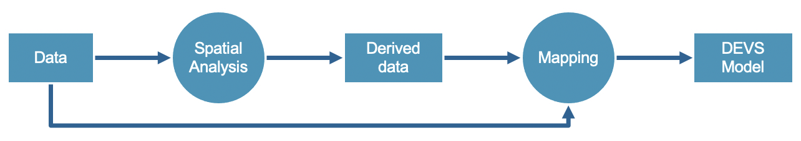

# Modeling: Spatial Analysis (DRAFT)

This repository has various open sources tools one could use for performing geospatial analysis. There are interactive **Jupyter Notebooks** available for demo purposes via **Binder**. Developers can also install Python packages themselves and run the code on their own in **Spyder**. For GIS experts, **GeoDa** and **QGIS** installation links are included at the bottom of the repo.

### Table of Contents 

- [Getting Started](https://github.com/omarkawach/spatial_analysis_scenarios#getting-started)
  - [Jupyter Notebook Demo of Scenarios](https://github.com/omarkawach/spatial_analysis_scenarios#jupyter-notebook-demo-of-scenarios)
  - [Python Development Setup](https://github.com/omarkawach/spatial_analysis_scenarios#python-development-setup)
- [Motivation and Objectives](https://github.com/omarkawach/spatial_analysis_scenarios#motivaiton-and-objectives)
- [Background](https://github.com/omarkawach/spatial_analysis_scenarios#background)
  - Intro to GIS
  - Intro to DEVS
  - Intro to Spatial Analysis
  - How do GIS and DEVS related to each other 
  - How will spatial analysis be used to build this relationship between GIS and DEVS
  - Model Generation Workflows
- [Discussion](https://github.com/omarkawach/spatial_analysis_scenarios#discussion)
- [Scenarios](https://github.com/omarkawach/spatial_analysis_scenarios#scenarios)
- [Credits and Acknowledgements](https://github.com/omarkawach/spatial_analysis_scenarios#credits-and-acknowledgements)
- [Resources](https://github.com/omarkawach/spatial_analysis_scenarios#resources)
- [Appendix](https://github.com/omarkawach/spatial_analysis_scenarios#appendix)

### Getting Started

#### Jupyter Notebook Demo of Scenarios 

[](https://mybinder.org/v2/gh/omarkawach/spatial_analysis_scenarios.git/master)

Select the `scenario_notebooks` folder once Binder has loaded the repo in Jupyter Notebook. Next, choose any notebook to demo. Make sure to set the kernel to Python 3 when prompted. 

**Note:** Some cells may need more than a few seconds or minutes to run. Some libraries may also be unsupported by Binder.

#### Python Development Setup

1. In a console, cd into your desired directory and run the following:
   
   `git clone https://github.com/omarkawach/spatial_analysis_scenarios.git`
   
2. [Download Anaconda and then launch Spyder](https://www.anaconda.com/products/individual)
   

3. Open a console where you cloned the repo, install all necessary python packages in one go using:
   
   ` pip install -r packages.txt `

4. You may now run/manipulate code

## Motivaiton and Objectives

Modelling and Simulation (M&S) has shown to be useful for studying real-world systems and to support decision-making through models that abstract systems under study. Building accurate models that adequately represents real-world systems is both difficult and time consuming, especially on a large-scale for complex spatial systems such as emergency response / services, urban logistics, etc. Since GIS data contains highly detailed, often hierarchically organized information that can be used to build simulation models, it is compatible with the modular nature of DEVS formalism. With this information in mind, the goal of this research is to determine a method for automating the generation of large-scale, spatial DEVS simulation models from GIS data. 

[Article Modeling and Simulation in Geographic Information Science: Integrated Models and Grand Challenges](https://www.sciencedirect.com/science/article/pii/S1877042811013267)

**Below is from presentation...**

The first step is to determine how GIS data can be used to build complex, large-scale spatial DEVS models.

This work seeks to answer several questions for future, more extensive research on the topic:
   - Which type of scenarios can GIS data help us model?
   - Which spatial analysis tools can be used? How can they be used?
   - What is a typical workflow that can convert GIS data into a simulation model?
   - How can DEVS models be parameterized from GIS data?
   - How can neighborhoods or couplings be derived from spatial properties?


## Background

#### GIS

Geographic information systems (GIS) open the door to the analysis, manipulation, and visualization of data spatially referenced to Earth. The two main components of spatial data are location (where) and attributes (what). These components of spatial data are mappable digitally and / or on paper. There also exist two main types of data in GIS. Vector data (objects) and raster data (field). Vector data can be 0-dimensional, 1-dimensional, and 2-dimensional. In the 0th dimension, coordinate points exist on their own. In the 1st dimension, two points can be used to create a line. In the 2nd dimension, three or more lines can be joined to make a polygon. Rasters can either be continuous (progressive data that varies) or discrete (thematic or categorical). Rectangular tessellated rasters are most common since they are easier mathematically. 

Maybe discuss the importance of a coordinate system?


#### DEVS

-- Bruno --

#### Spatial Analysis 

The utilisation of spatial analysis techniques in the field of GIS is imperative for revealing patterns, especially when solving real-world problems. From the wide range of spatial analysis techniques, this paper will focus on topological processing, spatial/attribute querying, network analysis, and interpolation techniques. 

[How to perform spatial analysis - ESRI](https://www.esri.com/arcgis-blog/products/product/analytics/how-to-perform-spatial-analysis/)

[Use cases - ESRI blog](https://www.esri.com/arcgis-blog/products/analytics/analytics/learn-spatial-analysis-techniques-with-scenario-based-case-studies/)


##### Topology Processing for Vector Analysis

Topology describes the relationship between one or more features within a space. In geometry, topological data does not consider factors like adjacency, contiguity, connectivity, intersection, etc. On the other hand, GIS requires topological data to be far more intelligent. Using topology to understand spatial relationships is an integral part of GIS.

When conducting GIS research, an area of interest needs to be selected. **Buffer (proximity) analysis** is the first step one could take to do this. Depending on the coordinate system being used, a buffer distance can be in degrees or other units of measure like meters, kilometers, feet, miles, etc. The application of buffer analysis does not stop at creating study areas. Buffer analysis could also be used for counting the number of spatial features within a radius.

**For Buffer Analysis: Make sure to change to a projected coordinate system before using buffers. For Ottawa, use UTM Zone 18N WGS 84. If we do not change the coordinate system, the buffer tool will assume degrees instead of distance.** 

Whether one is using polygons, lines, or points, various spatial relationship types could be used when conducting vector data analysis. Touches, contains, intersects, relation, within, crosses, and overlaps are some of the common keywords one would come across in a typical GIS application like QGIS. When using these relationship types, new layers are created. This process is called topological overlaying. For example, when the input is a point layer and the overlay layer is a polygon, then the output is a point. Therefore, the output of a topological overlay operation is always based on the input. The output can have attributes transferred by the input/output into the new layer or have no attributes transferred at all.

For an automated approach to proximity analysis in topology, one could take a collection of Voronoi (Thiessen) polygons and partion them by their distance to a point. [Voronoi Methods in GIS](http://citeseerx.ist.psu.edu/viewdoc/download?doi=10.1.1.86.3356&rep=rep1&type=pdf)


Spatial networks 
 - [Planar if 2D and edges only intersecting at the nodes - OSMnx](https://arxiv.org/pdf/1611.01890.pdf)
  
Spatial Join (analysis)


##### Query
  - Attribute queries are...to be cont'd
  - spatial queries are...
  - Filtering
  - https://www.researchgate.net/publication/321376749_Spatial_and_Attribute_Querying
 
##### Network Analysis

Isochrones for service areas??

Might be better to do this in ArcGIS: 
[SERVICE AREAS TO SHOW TIME INTERVALS OF TRAVEL ](https://desktop.arcgis.com/en/arcmap/latest/extensions/network-analyst/service-area.htm)

Could also try Iso-Area as Polygons (from layer) but the projection should be in UTM zones instead: https://root676.github.io/

Network analysis is commonly used in instances of urban planning / logistics studies. 

Least cost path versus Origin-Destination (OD) matrix

Sometimes shortest path isn't better than fastest path algorithm. Depends on whether you want to minimize distance travelled or minimize time travelled. 

Consider km/hr, typically 50km/hr by default.

##### Interpolation 

- IDW (Inverse Distance Weighting, a local method)
  - Follows TFL / Spatial autocorrelation
    - Close things are more related than distant things
  - Might not be good for surface calculations like elevation, but should be sufficient for our case since we'll look at concentration of elevation points.

"IDW and NN methods have been found to be good for interpolation of geo-morphologically smooth areas"
"Kriging methods take into consideration autocorrelation structures of elevations in order to define optimal weights."
[A comparative analysis of different DEM interpolation methods](https://www.sciencedirect.com/science/article/pii/S1110982313000276)

**Below is from presentation...**

Inverse Distance Weighting with Nearest Neighbor
  - Averages interpolated points
  - Prefers continuous concentration of points
  - Would work better for mineral extraction models

Triangulated Irregular Network
  - Requires more work but is good for surface calculations (elevation data)
  - Produces a large file since it is computationally expensive


#### Model Generation Workflows

**Below is from presentation...**
Before modelling, the following questions must be answered:
  - Is there a real-world system to model a spatial system? 
    - Are there any spatial relationships that can be used? 
  - Is geospatial data available?
    - Data is easy to find, good, complete data? not so much
  - Can the data be geo-processed? 
    - Are the right tools available? Is the hardware required available?

If all questions are answered, then we can consider a model generation workflow:



## Discussion

### Emergency Services - Health Unit Access Model

The rise in population across developed countries continues to put a strain on ambulance services and health care systems. Unlike ambulance services, studies that address the strain health care systems face are a lot more well-documented and reported on in the media ([Lowthian et al., 2011](https://www.researchgate.net/publication/50266341_Increasing_utilisation_of_emergency_ambulances)). For example, initiatives by the New South Wales (NSW) Ambulance to reduce ambulance demand has been proven to be ineffective due to the lack of reliable and consistent information. Only recently did NSW Ambulance begin publicly reporting on emergency ambulance response time ([NSW Govt, 2017](https://www.audit.nsw.gov.au/our-work/reports/managing-demand-for-ambulance-services-2017-)). Unfortunately, when it comes to patient outcome, response time data does not work well as a performance metric. Patient outcome can be improved through proper triage (prioritize) and dispatching, ambulance deployment modelling, and new technologies and processes like GIS ([Al-Shaqsi, 2010](https://www.ncbi.nlm.nih.gov/pmc/articles/PMC4806820/)). Through modern GIS software or shortest path algorithm, dispatchers can dispatch and relocate ambulances while considering travel time and location ([Nguyen, 2015](http://liu.diva-portal.org/smash/get/diva2:781472/FULLTEXT01.pdf))...

In the era of COVID-19, a protocol for patient at-home testing by trained paramedics could be brought to use ([Glauser, 2020](https://www.ncbi.nlm.nih.gov/pmc/articles/PMC7062433/)). Hypothetically, resources for such a protocol should be allocated based on the proximity of a patient's residence to a hospital. **Figure 4** depicts a study area composed of 3 Ottawa dissemination areas (DA) and the buildings within them. A graphical modeler can be utilised to automate the workflow of calculating the shortest path between a health care facility and a patient's residence (see **Figure 5**).  Afterwards, buildings can be assigned to their nearest hospital by using a simple [python script](https://github.com/omarkawach/spatial_analysis_scenarios/blob/master/scenario_files/health_units_refined.py). We'll call this assignment "Health Unit-Building (HUB) coupling". Then, all these HUB couplings will produce an Emergency Service Coupled Model (see **Figure 6**)... Come up with resulting model, any house that emits a call


**Figure 4**. Three Ottawa DAs and their Buildings


**Figure 5**. Road Distance Graphical Modeler


**Figure 6**. Health Unit - Building Couplings. Map created using QGIS 3.14 (https://www.qgis.org/en/site/).


**Figure 7**. Emergency Service Model Generation Workflow (needs to be updated, see presentation)

As an extension to this would be to target patient treatment by hospital speciality as well ([El-Masri, and Saddik, 2012](https://www.researchgate.net/publication/225279062_An_Emergency_System_to_Improve_Ambulance_Dispatching_Ambulance_Diversion_and_Clinical_Handover_Communication-A_Proposed_Model)). Can also consider population and number of buildings to service. 

Obviously, it **(avoid expletives)** would not be feasible to only cater to 3 DAs, so one must consider how to allocate emergency services on a city-wide scale. This is where more topological processing and network analysis continue to come in handy. From each DA polygon, a centroid can be extracted. Then, QNEAT3's OD Matrix in QGIS is used to find the network cost for an ambulance to go from a DA to a hospital. An output containing the distance from each DA to each hospital will appear. A simple python script is then used to assign each DA to their closest hospital.

**Process to move OD Matrix results to DA shapefile**
QNEAT3 Distance Matrices "OD Matrix from layers as lines (m:n)". Fix CRS first
Join Attributes by Field Value to DA choose ones within 2.5km using select by expression tool. 
- Match DAUID to origin_id
- Keep destination ID and total cost
- Join type is one-to-many
- Discard records which could not be joined
- Set prefix to OD_
- Discard records that couldnt be joined


**Figure 7**. Ottawa DAs Mapped to their Nearest Hospital. Map created using QGIS 3.14 (https://www.qgis.org/en/site/).


Alternate approache below (remove if not necessary)

Another option is to use Network analysis tool service area from layer and then convex hull or concave hull with NN


Limitations:
- The accuracy is left up to QGIS 
- We end up not serving houses that are on the same road
- Might have to expand the width ourselves


### Urban Logistics - Prescription Delivery Model

The delivery app market has become a hot market. Companies that currently run prescription delivery generally lack economic moat. A Canadian pharmacy chain, such as Shoppers Drug Mart, already has established customers and buying power for new technologies. If they were to release a prescription delivery app, they would likely dominate the market. To save on costs and increase efficiencies, Shoppers could deliver prescriptions to customers from the closest pharmacy. Hypothetically, before launching, Shoppers would first need to find willing participants to test a beta version of their prescription delivery application. 

In Ottawa, Jonathan, a 24-year-old Carleton University student has recently tested positive for COVID-19 and must self-isolate for two weeks. He calls his local Shoppers to see if they can deliver his monthly prescribed medication. The pharmacist at Jonathan's local shoppers lets him know that they don't currently offer such services, but it is in their services pipeline. To avoid waiting for prescription delivery services to be available, the pharmacist asks Jonathan if he'd like to participate in beta testing their new prescription delivery application. Jonathan agrees and provides Shoppers with his consent to conduct research. 

Before creating a study area, Tim, a GIS Analyst working for Shoppers must first ask himself the following questions:

- Where is Jonathan located?
- What distance(s) are delivery drivers permitted to drive?
- Where are the Shoppers Drug Marts within the driveable distance?

To answer these questions, Tim will need to acquire current data specific to Ottawa like road networks, building footprints, and Shoppers locations. Once this data has been acquired, only then can he start extracting data to fit the extent of his study area. Using building footprints, Tim locates Jonathan's building, and sets a 2.5km buffer around it. Tim uses a spatial intersection tool to find that 3 local Shoppers Drug Marts are within this buffer. Then, he uses Ottawa's road network to find the shortest path between Jonathan's building and the 3 local Shoppers Drug Marts. With some basic SQL code, only the closest Shopper's Drug Mart to Jonathan's building is coupled. In this case, a delivery driver would be dispatched from the Merivale location to deliver Jonathan's prescribed medication (see **Figure 8**). 

The delivery service workflow generated for this model can be reincorporated to not only support prescription delivery for pharmacies, but also to link distribution centers to population centers, warehouses to stores, warehouses to stores to customers, etc. For the case of pharmacies, the Graphical Modeler in **Figure 9** automates the majority of the delivery service workflow. The final output would be the path to the closest pharmacy, which is what was seen in **Figure 8**. 

Going a step further, the workflow can be implemented on a much larger scale. Suppose Shoppers is ready to launch their application and would like to have every Shoppers Drug Mart deliver prescriptions to customers within a 2.5km distance buffer. Voronoi diagrams would allow analysts to identify the closest Shoppers to a customer's building. This can be done through creating Voronoi polygons from all the Shoppers Drug Mart point data with a large buffer extent and then clipping the Voronoi polygons with our specified 2.5km distance buffer (see **Figure 13**). Then we can use the Graphical Modeler as seen in **Figure 11** to find the shortest path between the closest Shoppers to a customer. 


**Figure 8**. Closest Pharmacy 


**Figure 9**. Closest Pharmacy Graphical Modeler 


**Figure 10**. Delivery Service Model Generation Workflow (needs to be updated, see presentation)


**Figure 11**. Graphical Modeler for Finding the Distance between Pharmacies and Customers


**Figure 12**. Buildings with Access to Prescription Delivery near McCarthy


**Figure 13**. Large Scale Delivery


**Figure 14**. Delivery Service Coupled Model (change this entirely)

### Disaster Response

In Indonesia's Palu City, proactive disaster response, recovery, and relief is essential during emergency situations. Gadjah Mada University researchers implemented multi-ring buffers to capture shelter accaccessibility for Palu City. The researchers also considered road networks for mobility to access the shelters in the event of an earthquake. ([Fatma et al., 2019](https://doi.org/10.1117/12.2548660)). The application of multi-ring buffers does not stop at earthquake preparedness studies. 

As severe flooding increases across Canada due to climate change [Burton, 2015](https://thecanadianencyclopedia.ca/en/article/floods-and-flood-control), proactive measures by various levels of government is required. Without such intervention, flooding in regions like Ottawa-Gatineau will continue to become a problem for infastructure ([McNeil, 2019](https://files.ontario.ca/mnrf-english-ontario-special-advisor-on-flooding-report-2019-11-25.pdf)). Sandbags are commonly used as a defence against floods. Having data on which homes and neighbours to protect would be vital information. For example, assume a 1km flood risk buffer was created in one neighbourhood and then split into quarters via the multi-ring buffer method. Each ring in **Figure 16** can represent a sandbag line of defence so first responders can allot sandbags accordingly. The limitation for this model is that it does not take elevation into consideration. The speed and height at which water approaches a home is an important factor. The DAs surrounding the Wastewater Treatment Plant in Ottawa has a diverse amount of elevation. The severity of the flooding has been mapped using a three-ring buffer. Each ring in the three-ring buffer will represent 600m for a total of 1.8km. Also, the homes at the highest risk are those under 70m of elevation. To specify the amount of elevation in an area, Inverse Distance Weighting (IDW) with Nearest Neighbour (NN) Analysis is used to build a raster. Then we use the raster calculator to find which areas are below 70m of elevation. We then polygonise the raster and intersect it with the three-ring buffer. 


**Figure 16**. Buildings at Risk


**Figure 18**. Elevation Contours 


**Figure 19**. IDW with NN 


**Figure 20**. Raster Calculator Result (or add distance weight)


**Figure 21**. Buildings at Risk by Danger Zones and Elevations. Map created using QGIS 3.14 (https://www.qgis.org/en/site/).

Following the Lac-Mégantic rail disaster, the Transport Safety Board (TSB) of Canada made a few recommendations to be better prepared to prevent similar disasters. One of the recommendations was to have "Emergency response assistance plans must be created when large volumes of liquid hydrocarbons, like oil, are shipped" ([TSB, 2019](https://www.tsb.gc.ca/eng/rapports-reports/rail/2013/r13d0054/r13d0054-r-es.html)). Help dispatch and evacuate people.

Ottawa's Montfort Hospital has had a chemical spill. Residents who are directly within 0.5km of the hospital are warned to evacuate immediately. Residents whose ONS Boundary touch with the 1.5km buffer are also expected to evacuated moments later. Before First Responders head into the polygons impacted by the chemical spill, they want to know how many buildings are impacted so that they may act by priority. This research would allow First Responders to know an approximate headcount as well. 


**Figure 9**. Overview of Chemical Spill Scenario. Map created using QGIS 3.14 (https://www.qgis.org/en/site/).

https://www.usbr.gov/power/edu/pamphlet.pdf

Hydroelectricity from the Hydro Ottawa Rideau Falls facility is capable of delivering power to consumers. Should an outage occur, a large number of buildings within ONS polygons that touch the 2km power outage buffer would be out of power. If such an event were to occur, the City of Ottawa would like to know which buildings are without power and which ONS polygon they reside in. 

Used 'Extract by location' instead of intersect to find polygons touching buffer


**Figure 12**. Ottawa DAs and Buildings Without Power. Map created using QGIS 3.14 (https://www.qgis.org/en/site/).

## Scenarios

### Healthcare - Finding Polygons that Contain Hospitals

Ottawa resident, Mary, is looking for a new apartment to rent. She tells her Real Estate Agent that she would like to live within a boundary that has a hospital in it since she requires regular visits for post-op checkups. To meet Mary's apartment criteria, a spatial join (analysis) must be conducted. 

GIS analysts conduct spatial joins by taking one feature and seeing if it *intersects* with another feature. In this case, the GIS analyst would see if a hospital point is within an ONS polygon. This would allow us to define new neighbourhoods based on whether a polygon has a hospital or not. For this spatial join, we could also try one or more spatial relationship types like *touches, contains, within,* and *relation*. 

After analysis, Mary would receive results stating that she may look for apartments in the ten following areas: 
- Civic Hospital
- Central Park
- Billings Bridge 
- Alta Vista
- Riverview
- Wateridge Village
- Qualicum 
- Redwood Park
- West Centretown
- Byward Market


**Figure 1**. ONS polygons with Hospitals in them


### Dealing with Populations - Classify Neighbourhoods by Population Density

At Statistics Canada, an intern would like to conduct a population density study using ONS data. The data gathered would be used for defining new neighbourhoods based on a simple quartile classification algorithm. 


**Figure 13**. ONS Population Density

**Legend**


**Figure 14**. ONS Quartile Classification for New Neighbourhoods

*Potential Use Case*
1. Model highly infectious populations according to population density
   - We may theorize that more dense areas play an impact on the number of cases in neighbouring polygons. 
   - Expand to have topological relationships 
     - Maybe have buffers based on infection spread

### Transit - Finding the Nearest Bus Stop(s) to a Building 

JTFS

Find the nearest bus stop to each building within specific Ottawa DAs. This can be done by using bus stops to create voronoi polygons. Then, intersect the voronoi polygons with the Ottawa DAs. This scenario assumes that the vertices from each bus route are bus stops, even if that is not the case.  


**Figure 17**. Overview of Closest Bus Stop(s) to each Building in DAs

### Travel - Fastest Route to the First Road Crossing in a List

We're in the center of Ottawa and want to find the shortest path to a road crossing through network analysis. 


**Figure 18**. Shortest path

### Spatial Weights - Proximity Analysis between Polygons

For the ONS dataset, we are looking for ways to represent the spatial relationships between polygons. We do this by depicting a spatial weight network (planar). In this case, the Queen contiguity weight lets us look at shared edges or vertices between polygons. 


**Figure 19**. Spatial Weight Network Ottawa

*Potential Use Case*
1. [Boundary Detection](https://geographicdata.science/book/notebooks/04_spatial_weights.html) to observe differences in wealth (Spatial Econometrics)
   - [Combining spatial statistics and spatial data analysis](http://resources.esri.com/help/9.3/arcgisengine/java/gp_toolref/spatial_statistics_toolbox/spatial_weights.htm)


## Credits and Acknowledgements

[Carleton University - ARSLab](https://arslab.sce.carleton.ca/) 

[Sarah Loos - UVic GEOG 328 GIS Analysis](https://www.uvic.ca/calendar/undergrad/#/courses/BkL7SOamV?bc=true&bcCurrent=GIS%20Analysis&bcItemType=Courses)

[Qiusheng Wu - Python Geospatial Repo on GitHub](https://github.com/giswqs/python-geospatial)

## Resources

### Notebooks

[Binder: ](https://mybinder.org/)Notebooks in an Executable Environment

[Jupyter Notebook: ](https://jupyter.org/)Interactive Python Notebooks

### Python Packages

[Matplotlib: ](https://matplotlib.org/)Visualization with Python

[Pandas: ](https://pandas.pydata.org)Data Analysis in Python

[GeoPandas: ](https://geopandas.org/)Work with Geospatial Data in Python

[Shapely: ](https://pypi.org/project/Shapely/)Manipulate and Analyze Geometric Objects

[NetworkX: ](https://networkx.github.io/)Network Analysis in Python

[OSMnx: ](https://github.com/gboeing/osmnx)Python for Street Networks

[PyProj: ](https://github.com/pyproj4/pyproj)For Projections in Geospatial Data

[PySal: ](https://pysal.org/)Spatial Analysis Library

[NumPy: ](https://numpy.org/)Scientific Computing with Python

[Descartes: ](https://pypi.org/project/descartes/)For Plotting Polygons in GeoPandas

[Geovoronoi:](https://github.com/WZBSocialScienceCenter/geovoronoi) For Plotting Voronoi Regions inside Geographic Regions

### Geospatial Analysis Program(s)

[QGIS Download: ](https://www.qgis.org/en/site/)Open Source Geospatial Analysis Program

[QGIS Docs: ](https://www.qgistutorials.com/en/)Tutorials and Tips

### IDE

[Spyder: ](https://www.spyder-ide.org/)Scientific Python Development Environment

## Appendix 

### Dataset Sources

**[Ottawa Neighbourhood Study (ONS) from Carleton University](https://library.carleton.ca/find/gis/geospatial-data/ottawa-neighbourhoods)**

*Shapefile Location*

See [`/shapefiles/ONS`](https://github.com/omarkawach/spatial_analysis_scenarios/tree/master/shapefiles/ONS)


*Description from source:*
```
The ONS Neighbourhood Boundaries were created by the Ottawa Neighbourhood Study
(ONS) to analyse population statistics and are not indicative of actual 
neighbourhood limits.  Neighbourhood refers to an inhabited area delineated by 
social and physical boundaries. ONS neighbourhood boundaries were derived based on 
census tracts, physical and demographic similarities, physical barriers (e.g. 
waterways, highways, etc.), maps used by the real estate profession (e.g. the 
Ottawa Multiple Listing Service), consultations with community stakeholders, as 
well as fieldwork by ONS researchers.

108 neighbourhood boundaries are included in the shapefile, 
from Barrhaven to Woodvale. 
```

**[Hospitals from Open Ottawa](https://open.ottawa.ca/datasets/b769ce497f2540aa962e602c983994d6_0?geometry=-76.050%2C45.348%2C-75.396%2C45.433)**

*Shapefile Location*

See [`/shapefiles/OttawaHospitals`](https://github.com/omarkawach/spatial_analysis_scenarios/tree/master/shapefiles/OttawaHospitals)

*Description from source:*
```
Map containing point features of Hospitals located in the City of Ottawa.
```

**[Open Database of Building from Statistics Canada](https://www.statcan.gc.ca/eng/lode/databases/odb)**

*Shapefile Location*

See [`/shapefiles/OttawaBuildings.zip`](https://github.com/omarkawach/spatial_analysis_scenarios/tree/master/shapefiles/OttawaBuildings.zip)

*Description from source:*

```
The Open Database of Buildings (ODB) is a collection of open data on buildings,
primarily building footprints, and is made available under the Open Government 
License - Canada.
```

**[Ottawa Dissemination Areas (DA) from Open Ottawa](https://open.ottawa.ca/datasets/89fe8cb18d7345b2b666623ccb872310_0?geometry=-78.333%2C44.878%2C-73.101%2C45.555)**

*Shapefile Location*

See [`/shapefiles/OttawaDA`](https://github.com/omarkawach/spatial_analysis_scenarios/tree/master/shapefiles/OttawaDA)

*Description from source:*

```
The Dissemination Area Boundary Files portray the dissemination area boundaries
for which Census data are disseminated. A dissemination area is a small area
composed of one or more neighbouring dissemination blocks and is the smallest
standard geographic area for which all census data are disseminated.
```

**[OC Transpo Routes from Carleton University](https://library.carleton.ca/find/gis/geospatial-data/oc-transpo-transit-routes)**

*Shapefile Location*

See [`/shapefiles/OC_TRANSPO_ROUTES`](https://github.com/omarkawach/spatial_analysis_scenarios/tree/master/shapefiles/OC_TRANSPO_ROUTES)

*Modifications to Original Dataset in this Repo:*

The dataset came with hundreds of shapefiles. All the shapefiles were merged into one. 

*Description from source:*

```
Individual vector transit routes for OC Transpo between 1929 and 2015. 

The following information was collected for each transit route:
- Route Number
- Route Type (Regular, Peak, Express, Rural, etc.)
- Mode of Transportation (bus, train)
- Year
```


**[Road Network Files from Statistics Canada](https://www12.statcan.gc.ca/census-recensement/2011/geo/RNF-FRR/index-eng.cfm)**

*Shapefile Location*

See [`/shapefiles/OttawaRoads`](https://github.com/omarkawach/spatial_analysis_scenarios/tree/master/shapefiles/OttawaRoads)

*Modifications to Original Dataset in this Repo:*

The dataset came with the whole road network of Canada. Modified the dataset to only have Ottawa's road network. 

*Description from source:*

```
Road network files are digital representations of Canada's
national road network, containing information such as street
names, types, directions and address ranges.
```

**[Waterbody Data from Rideau Value Conservation Authority (RVCA)](https://rvcagis.github.io/jkan/)**

*Description from Source*

https://rvcagis.github.io/jkan/datasets/rvca-waterbodies/

```
RVCA Waterbodies represent the Lakes, Ponds and large Rivers within the RVCA, as a
polygon feature class. They have been delineated using the MNRF LIO waterbody standard
and using the existing LIO Waterbody layer as a base. This dataset is used extensively
for Subwatershed & Catchment Reporting, as well as Regulations
```