# Modeling: Spatial Analysis (DRAFT)

This repository has various open sources tools one could use for performing geospatial analysis. There are interactive **Jupyter Notebooks** available for demo purposes via **Binder**. Developers can also install Python packages themselves and run the code on their own in **Spyder**. For GIS experts, **GeoDa** and **QGIS** installation links are included at the bottom of the repo.

Outline for the paper:
- Motivaiton and Objectives
- Background
  - Intro to GIS
  - Intro to DEVS
  - Intro to Spatial Analysis
  - How do GIS and DEVS related to each other 
  - How will spatial analysis be used to build this relationship between GIS and DEVS
- Discussion
  - Models and some background


### Getting Started

#### Jupyter Notebook Demo of Scenarios 

[](https://mybinder.org/v2/gh/omarkawach/spatial_analysis_scenarios.git/master)

Select the `scenario_notebooks` folder once Binder has loaded the repo in Jupyter Notebook. Next, choose any notebook to demo. Make sure to set the kernel to Python 3 when prompted. 

**Note:** Some cells may need more than a few seconds or minutes to run. Some libraries may also be unsupported by Binder.

#### Python Development Setup

1. In a console, cd into your desired directory and run the following:
   
   `git clone https://github.com/omarkawach/spatial_analysis_scenarios.git`
   
2. [Download Anaconda and then launch Spyder](https://www.anaconda.com/products/individual)
   

3. Open a console where you cloned the repo, install all necessary python packages in one go using:
   
   ` pip install -r packages.txt `

4. You may now run/manipulate code

## Motivaiton and Objectives

Modelling and Simulaiton (M&S) has shown to be useful for studying real-world systems and to support decision-making through models that abstract systems under study. Building accurate models that adequately represents real-world systems is both difficult and time consuming, especially on a large-scale for complex spatial systems such as emergency response / services, urban logistics, etc. Since GIS data contains highlighy detailed, often hierarchically organized information that can be used to build simulation models, it is compatible with the modular nature of DEVS formalism. With this information in mind, the goal of this research is to determine a method for automating the generation of large-scale, spatial DEVS simulation models from GIS data. 

## Background

#### GIS

Geographic information systems (GIS) open the door to the analysis, manipulation, and visualization of data spatially referenced to Earth. The two main components of spatial data are location (where) and attributes (what). These components of spatial data are mappable digitally and / or on paper. There also exist two main types of data in GIS. Vector data (objects) and raster data (field). Vector data can be 0-dimensional, 1-dimensional, and 2-dimensional. In the 0th dimension, coordinate points exist on their own. In the 1st dimension, two points can be used to create a line. In the 2nd dimension, three or more lines can be joined to make a polygon. Rasters can either be continuous (progressive data that varies) or discrete (thematic or categorical). Rectangular tessellated rasters are most common since they are easier mathematically. 

**Find somewhere else to put this?**
Geographical tracking and mapping of pandemic data through the application of Geographic Information Systems (GIS) has been proven to be a powerful system for disease monitoring and planning ([Buolos & Geraghty, 2020](https://ij-healthgeographics.biomedcentral.com/articles/10.1186/s12942-020-00202-8)). Such a system allows researchers to present large volumes of data in an intuitive way. For one, web-based mapping has created an environment for accessible remote collaboration between decision makers ([Franch-Pardo et al., 2020](https://www.sciencedirect.com/science/article/pii/S0048969720335531)). By integrating simulation models into map-based web applications, researchers can also highlight spatiotemporal trends in various scenarios. 

(hospitals --> map onto, paramters doctors, beds, etc.). Then processing it and turning it into a model. Library of models. 

First half of simulation life cycle...library later, code behaviour


#### DEVS

-- Bruno --

#### Spatial Analysis (the flow here is weird...fix later)

Questions to answer
1. Data manipulation
   - Process, project, etc.
2. spatial data statistical analysis
3. spatial modelling
4. visualizing 

The utilisation of spatial analysis techniques in the field of GIS is imperative, especially when solving real-world problems. From the wide range of spatial analysis techniques, this paper will focus on topological, geostatistical, spatial/attribute querying, network analysis techniques. 


[Article on coupling large scale models to GIS](https://www.sciencedirect.com/science/article/pii/S1877042811013267)

[More ESRI](https://www.esri.com/arcgis-blog/products/product/analytics/how-to-perform-spatial-analysis/)


[Use cases ESRI blog](https://www.esri.com/arcgis-blog/products/analytics/analytics/learn-spatial-analysis-techniques-with-scenario-based-case-studies/)


##### Topology Processing

  - A topology is...to be cont'd
  - Buffers (proximity)
  - [Voronoi diagrams embody a form of "automated" topology](http://citeseerx.ist.psu.edu/viewdoc/download?doi=10.1.1.86.3356&rep=rep1&type=pdf)
  - Spatial networks 
    - [Planar if 2D and edges only intersecting at the nodes ](https://arxiv.org/pdf/1611.01890.pdf)
  - Spatial Join (analysis)
  - [Spatial relationship types](https://desktop.arcgis.com/en/arcmap/latest/extensions/data-reviewer/types-of-spatial-relationships-that-can-be-validated.htm)
    - Touches
    - Contains
    - Intersects
    - Relation
    - Within
    - Crosses
    - Overlaps

Data issues with spatial dependce (how data relates in space)
- MAUP (Modifiable Areal Unit Problem)
  - Location of boundaries used to aggregate data can influence results of statistical tests (Moran's I)
  - How boundaries impact summary statistics (look at stdev most importantly)
  - Gerrymandering is a good example of this (larger population decides the election)
  - Difficult to get proportional representation (redrawing district lines), lopsided representation, political polarization
- Scale can cause problems 
  - Data can become homogenous, impacts autocorrelation 
- Ecological fallacy like MAUP
  - Individuals vs Popuplations 
  - Cant take aggregated results and apply them to individuals
  - statistical result change based on data aggregation
  - Provincial average income versus municipal average income (cant assume an individual makes provincial avg if they live in Toronto)
- Boundary Problem
  - Segments data
  - when data excluded due to boudnary, lose of information that influences the data that remains (we could pull things out of context)
  - can impact statistical tests
  - Best practice to keep SOME surrounding data


##### Spatial Statistics (needs to be run)
  - Spatial autocorrelation follows toplers law
    - Spatial data = spatial autocorrelation
    - introduces redundancy in data, affects the outcome of statistical tests and correlation coefficient
      - CC = relationship between two values (or multiple locations) using Moran's I
        - Check to see if patterns dont occur just by chance, accept or reject hypothesis, show the distribution is not random (cause and effect in data), p-value, z-score
      - Moran's I to assess spatial autocorrelation (most people dont bother since data came as they were)
        - where n is the number of regions or spatial units, with a weighting matrix (w)
        - can incorporate contiguity, adjacency, and distance as well as attribute data (concepts of topology)
        - between -1 and +1
          - +ve is similar values found together
          - -ve is disisimilar values found together (rare)
          - 0 means dist is **random** and no spatial autocorrelation
      - Look at dispersed (negative I) versus clustered (positive I)
      - Measure signifigance of Moran's I
        - Look at p-values (prob. spatial autocorrelation is correlated, look for low value )and z-score (absolute value means your data is likely to spatially autocorrelated, look for high value, stdev of mean)
      - Distance decay
        - Moran's I decreases as more observations (farther away) are included in the calculations, therefore less influence
    - Use for finding hotspots (maybe like concencration of retired people, where are they in a population)
    - Most stats assume data is random, but not when it comes to spatial data
  - Map clusters (density, identify hotspots (of covid))
  - Spatial relationships (weights matrix, GWR)
  - nearest neighbour, inverse distance, and classifcations are not geostatistics
  - spatiotemporal = space and time
  - [First law of geography](https://wiki.gis.com/wiki/index.php/First_law_of_geography) 

Limitations
- GWR https://pro.arcgis.com/en/pro-app/tool-reference/spatial-statistics/geographicallyweightedregression.htm 

https://www.ncbi.nlm.nih.gov/pmc/articles/PMC7395580/ 

https://www.youtube.com/watch?v=V_OE8Kqp1dM 

https://github.com/GeoDaCenter/covid 

https://www.ncbi.nlm.nih.gov/pmc/articles/PMC7139267/ 

DOES THE NEIGHBORING MAKE SENSE??? YOU CANT HAVE ISLANDS SINCE THERE ARE NO NEIGHBOURS. YOU HAVE TO FIX THAT SOMEHOW

LOWER THE WEIGHT OF THINGS FARTHER AWAY IF YOU DO DISTANCE (DISTANCE BASED WEIGHT) - TOPPLERS LAW

ROW STANDARDIZATION WEIGHTS BETWEEN 0 AND 1, INTERPRETATION AS AVERAGE OF NEIGHBORS
- instead of contiguity matrix (zeroes and ones if neighbors), it uses weights matrix
  - you want to do this most of the time 
    - you want the sum of all the weights to equal one 
      - ex. three neighbours to one and divide by 3
      - ex. 5 neighbours divide 1 by five
    - gives each area we're interested in, and equal weight
      - each give us an equal amount to what we're computing
        - spatial correlating or regression

LAG MODEL - spatial lag / autoregressive model SAR myth paper

https://www.mdpi.com/2225-1146/2/4/217/htm

Moran's I? What do the values mean? Maybe see how population impacts the number of neighbors you have? Check out space in geoda and click univariate morans i or do the local one to see potentially statistically signifcant areas
- lisa cluster map
- lisa signifigance map

WEIGHT MATRICES FOR SPATIAL CORRELATION (shouldnt have large impact)
- QUEEN
  - shared boudnary or shared corner
- ROOK
  - only shared boudnary 
- DISTANCE
  - neighbors within distance (by row standardization)
  - know if lat/lon or cartesian first 
  - lon/lat
    - use arc distance (over surface of sphere)
  - cartesian 
    - use euclidiean 
- INVERSE DISTANCE
  - closest in some sense by strongest neighbour 
    - could be by non spatial aspects 
  - 
- KERNEL 
- K-NEAREST neighbor (knn)
  - x nearest neighbours 
  - based on centroids and euclidian distance

PRESCISION FRESHOLD
- when two shapes meet at a point, how precise do you want the point to be

SYMMETRY
- ASYMETRIC
- NON ASYMETRIC

ORDER OF CONTIGUITY
- 1
  - ONLY IF YOU TOUCH ON A BORDER OR CORNER DIRECTLY WILL U BE A NEIGHBOR
- 2
  - NEIGHBOR OF A NEIGHBOR IS ALSO A NEIGHBOR OF MINE LOCATION -> NEIGHBOR -> NEIGHBORS NEIGHBOR
  - Here is where you should maybe select include lower orders

What is spatial lag? https://libraries.mit.edu/files/gis/regression_presentation_iap2013.pdf 
- Spatial autocorrelation http://ncgia.ucsb.edu/technical-reports/PDF/92-10.pdf

- Not that it wont always be just 6 or 12 neighbours

We have a shapefile containing the population and homes in hundreds of DAs.
- Create knn weights k=6 and create an inverse as well https://geodacenter.github.io/workbook/4b_dist_weights/lab4b.html#creating-knn-weights 
- Then do one with epanechnikov kernel weight
- create spatially lagged variable
  - spatial lag in table calculator 
  - try with k6 first
    - spatial lag with row standardized weights
      - k6_sc_lag = avg houses of 6 neighbors = (x1 + x2 ... x6) / 6 with row standardized weights
    - spatial lag as a sum of neighboring values
      - k6_sc_lag2 = sum of pop of six neighbors
    - spatial window average
      - k6_sc_lag3 = the observation itself and the average so divided by 7 instead
    - spatial window sum
      - without dividing by 7


##### Query
  - Attribute queries are...to be cont'd
  - spatial queries are...
  - Filtering
  - https://www.researchgate.net/publication/321376749_Spatial_and_Attribute_Querying
 
##### Network Analysis

Network analysis is commonly used in instances of urban planning / logistics studies. 


## Discussion

### Spatial Statistics - COVID-19 Spread Model (weights)

NEED TO VALIDATE COVID SPREAD MODEL (spatial autocorrelation to confirm spatial dependecy) https://geodacenter.github.io/workbook/5a_global_auto/lab5a.html
https://geodacenter.github.io/workbook/5b_global_adv/lab5b.html 

- Queen weight using ward#
- Click univariate local moran's I and select cummulative covid cases

Local indicators of spatial association (LISA) for clustering

LISA CLUSTER MAP (where the concentration of covid cases are, therefore hot spots and cold spots

Maybe only consider high high?

spatial clusters
- high high (red)
  - high cases within itself and surrounding areas
- low low (blue)
  - low cases when surrounding areas have more cases

spatial outliers 
- high low (light red) 
  - high cases when surrounding areas have low cases
- low high (light blue)

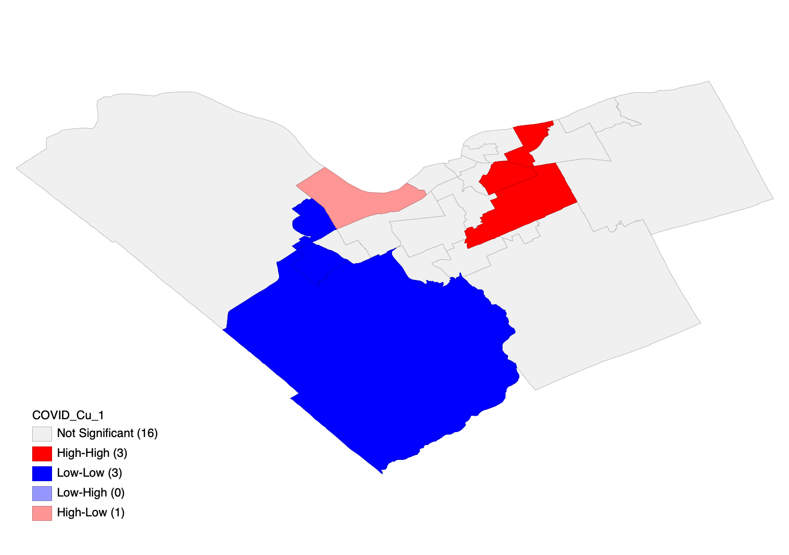


LISA SIGNIFIGANCE MAP (see how confident we can be in our clusters, darkest values are most confident to show this relationship wasnt found by chance)
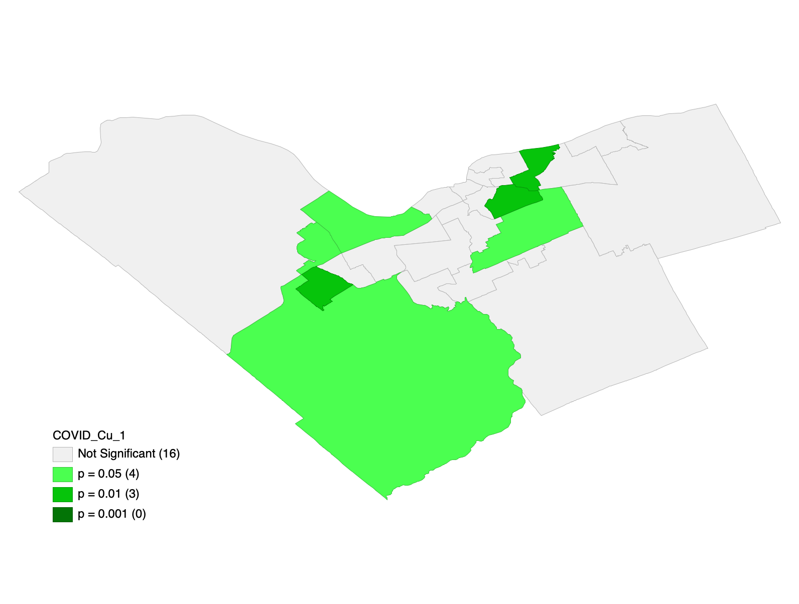

Moran's I scatterplot (draws the cluster map)
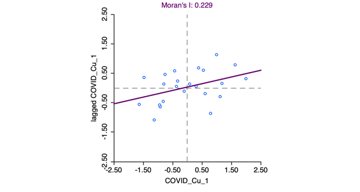


https://www.medrxiv.org/content/10.1101/2020.05.28.20115626v1.full.pdf

Since the inception of TFL, researchers in the GIS community have employed such a concept to describe spatial dependence ([Leitner et al., 2018](https://www.researchgate.net/publication/323419139_Laws_of_Geography)). In the field of epidemiology, one could apply TFL to synthetically simulate the spread of infectious diseases in a geographical environment based on spatial weighting ([Zhong et al., 2009](https://www.researchgate.net/profile/Song_Dunjiang/publication/226204125_Simulation_of_the_spread_of_infectious_diseases_in_a_geographical_environment/links/00b495316b307a20ab000000/Simulation-of-the-spread-of-infectious-diseases-in-a-geographical-environment.pdf)). Such an application can play a vital role in disease prevention and control when coupled with modern spatio-temporal analysis techniques ([Watkins et al., 2007](https://www.ncbi.nlm.nih.gov/pmc/articles/PMC1805744/)). 

The recent COVID-19 outbreak has made it apparent how unprepared governments are for a global pandemic of this scale ([Timmis, and Brussow, 2020](https://sfamjournals.onlinelibrary.wiley.com/doi/10.1111/1462-2920.15029)). Matters are made worse by the fact that large, and even small-scale problems are difficult for humans to conceptualize. This is especially true when we consider global issues like global warming ([Resnik et al., 2016](https://onlinelibrary.wiley.com/doi/full/10.1111/cogs.12388)). Given the unprecedented amount of data surrounding the ongoing pandemic, local / national / global real-time, non-real-time, or simulated disease cases must be carefully analyzed to recognize high risk geographical regions which may be susceptible to outbreaks or further disease spreading. 


Spatial models involving the spread of COVID-19 between populations offers a unique perspective into how cases can spillover (USE A BETTER WORD) from densely populated areas to less dense areas ([Eilersen, and Sneppen, 2020](https://www.medrxiv.org/content/10.1101/2020.09.04.20188359v1.full.pdf) **NOT YET PEER REVIEWED**). In **Table 1**, the data retrieved from the City of Ottawa reveals the number of cumulative  COVID-19 cases by ward as of September 25, 2020. The COVID-19 dataset from the City of Ottawa did not provide population statistics, so it had to be added manually by spatial joining data from an Ottawa DA shapefile. 

**Table 1**. cumulative  COVID-19 Cases as Reported on September 25 (maybe use more up to date info later)

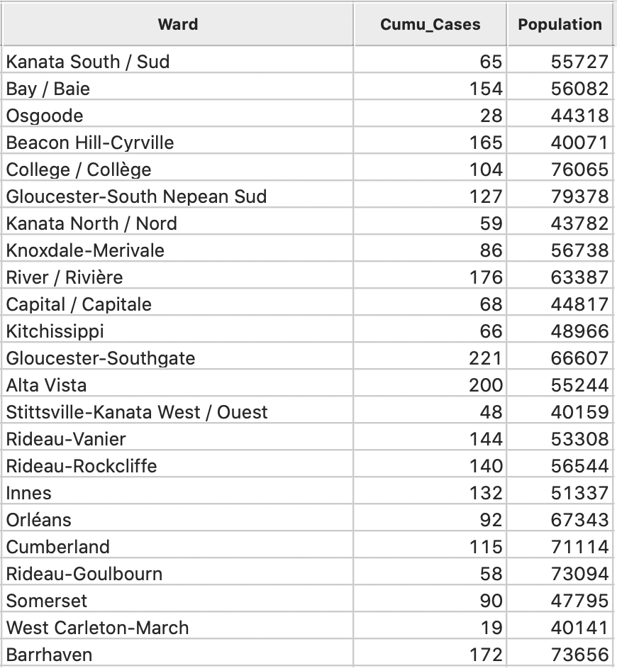

**Note**: Exlucdes retirement home and longterm care home cases

To better visualize the data from **Table 1**, the number of cases per capita (*Cumu_cases / Population*) was plotted onto a map using quantile classification (6 classes).


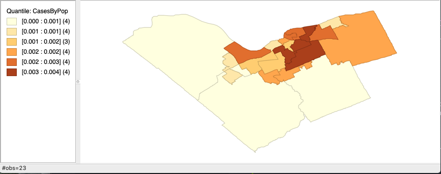

**Figure 1**. COVID-19 cases per capita 

Before thematically identifying which wards are at a high risk of disease case spillover (USE A BETTER WORD), a Queen matrix was applied to the Ottawa Wards shapefile to find each ward's neighbours by shared border and corners. 

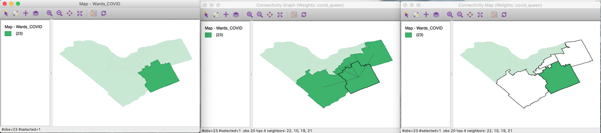

**Figure 2**. Osgoode Ward and it's Neighbours  

A spatial lag calculator with row-standardized weights would give every ward an equal weight since the Queen matrix would be fractional instead of zeroes and ones (contiguity). Using the spatial lag calculator, one could sum the number of cases in each neighbouring ward and then divide by the number of neighboring wards (*Queen * (Cumu_cases / Population)*). Plotting this result shows the wards at a high risk of disease spillover (USE A BETTER WORD) from neighbouring wards. 


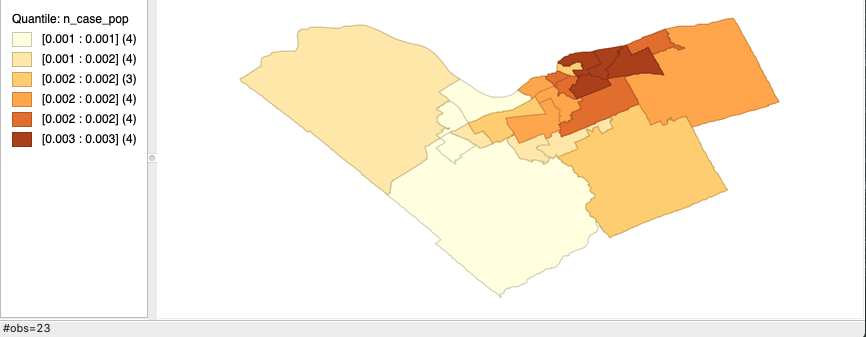
**Figure 3**. Quantile Classification of Wards at Risk of Disease Spillover (USE A BETTER WORD)

*Possible Use Case*
1. We could see which buildings are in a DA and connect them for population growth analysis.
   - Does the number of buildings in a DA impact population? Will likely need statistics data for this

### Emergency Services - Health Unit Access Model

The rise in population across developed countries continues to put a strain on ambulance services and health care systems. Unlike ambulance services, studies that address the strain health care systems face are a lot more well-documented and reported on in the media ([Lowthian et al., 2011](https://www.researchgate.net/publication/50266341_Increasing_utilisation_of_emergency_ambulances)). For example, initiatves by the New South Wales (NSW) Ambulance to reduce ambulance demand has been proven to be ineffictive due to the lack of reliable and consistent information. Only recently did NSW Ambulance begin publicly reporting on emergency ambulance response time ([NSW Govt, 2017](https://www.audit.nsw.gov.au/our-work/reports/managing-demand-for-ambulance-services-2017-)). Unfortunately, when it comes to patient outcome, response time data does not work well as a performance metric. Patient outcome can be improved through proper triage (prioritize) and dispatching, ambulance deployment modellng, and new technolgies and processes like GIS ([Al-Shaqsi, 2010](https://www.ncbi.nlm.nih.gov/pmc/articles/PMC4806820/)). Through modern GIS software or shortest path algorithm, dispatachers can dispatch and relocate ambulances while considering travel time and location ([Nguyen, 2015](http://liu.diva-portal.org/smash/get/diva2:781472/FULLTEXT01.pdf))...

In the era of COVID-19, a protocol for patient at-home testing by trained paramedics could be brought to use ([Glauser, 2020](https://www.ncbi.nlm.nih.gov/pmc/articles/PMC7062433/)). Hypothetically, resources for such a protocol should be allocated based on the proximity of a patient's residence to a hospital. **Figure 4** depicts a study area composed of 3 Ottawa DAs and the buildings within them. A graphical modeler can be utilised to automate the workflow of calculating the shortest path between a health care facility and a patient's residence (see **Figure 5**).  Afterwards, buildings can be assigned to their nearest hospital by using a simple [python script](https://github.com/omarkawach/spatial_analysis_scenarios/blob/master/scenario_files/health_units_refined.py). We'll call this assignment "Health Unit-Building (HUB) coupling". Then, all these HUB couplings will produce an Emergency Service Coupled Model (see **Figure 6**). 

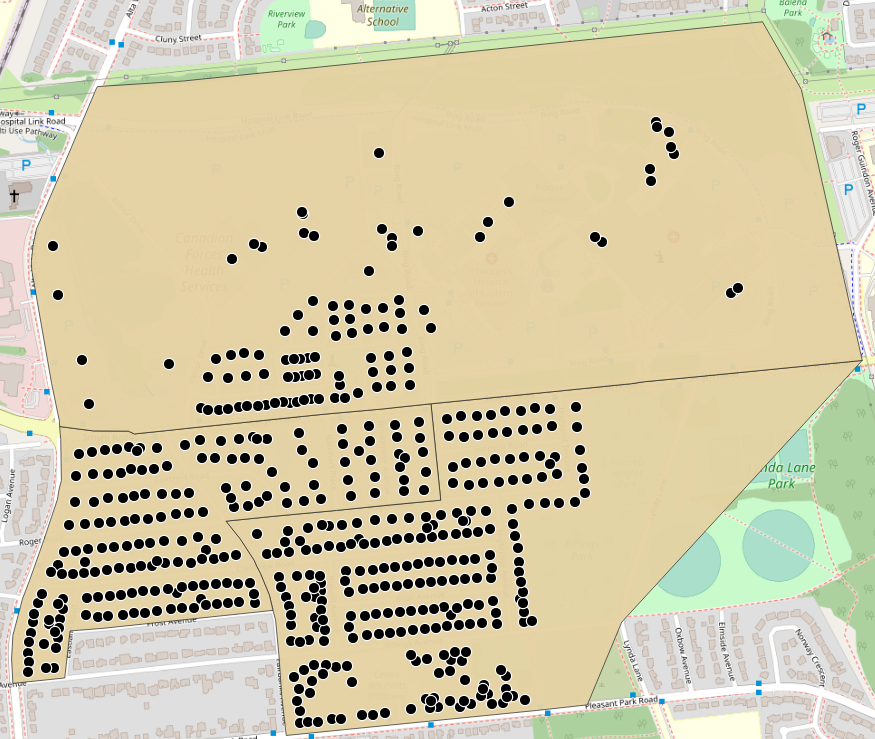

**Figure 4**. Three Ottawa DAs and their Buildings

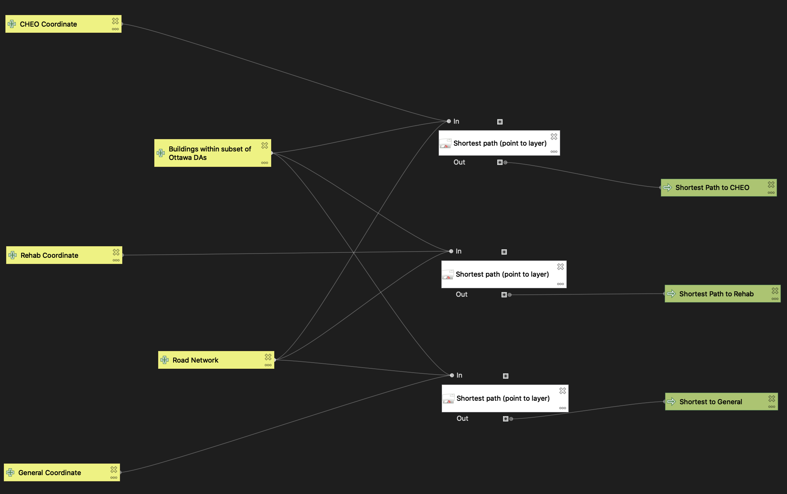

**Figure 5**. Road Distance Graphical Modeler

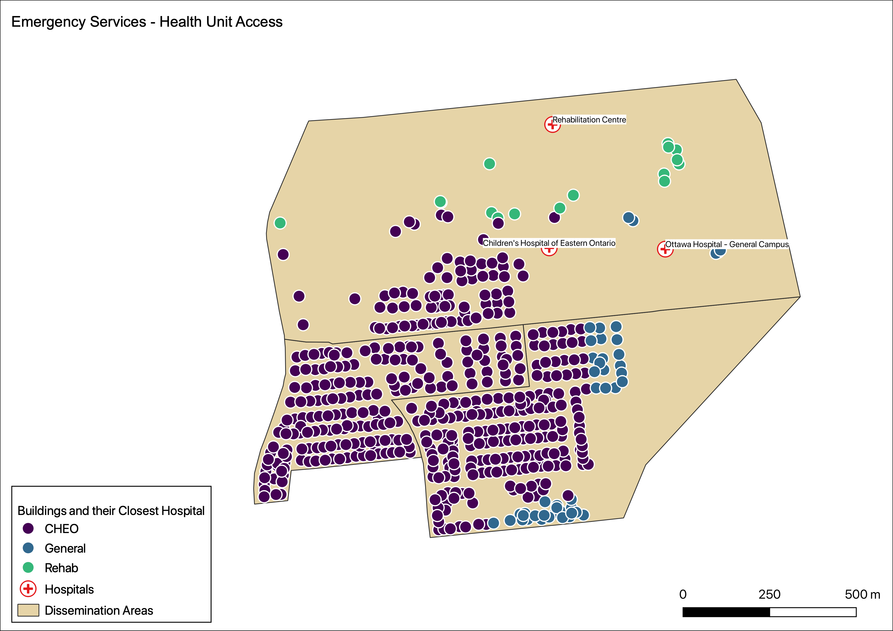

**Figure 6**. Health Unit - Building Couplings

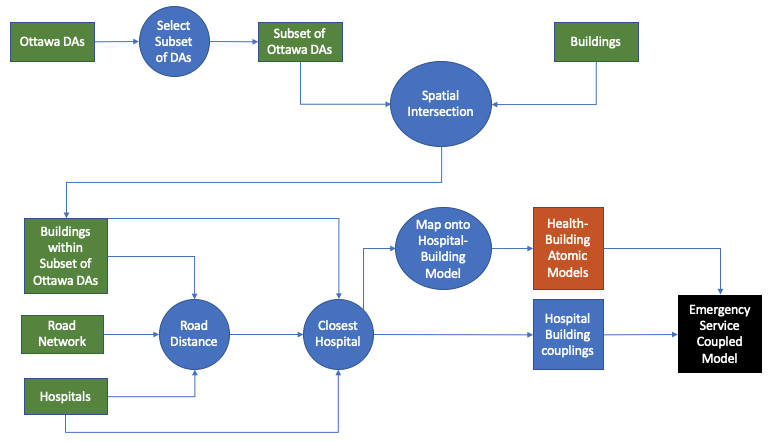

**Figure 7**. Emergency Service Model Generation Workflow

An extension to this  we can Target by category to hospital specialty : https://www.researchgate.net/publication/225279062_An_Emergency_System_to_Improve_Ambulance_Dispatching_Ambulance_Diversion_and_Clinical_Handover_Communication-A_Proposed_Model 

We can also use fastest path algorithm instead of shortest path when considering km/hr

Alternate approache below (OD Matrix)

Through topological studies and proximity analysis, 9-11 Operators discovered what hospital each ONS polygon should be assigned. Now, it's time for them to put their research to the test. 9-11 Operators just received a call from someone living in the Royal Ottawa Hospital neighbourhood. In order to get an ambulance to the caller's building quickly, they require network analysis. The shortest path algorithm is run on Ottawa's Road Network from the hospital to the caller's building. 

Extract centroids from DAs. 
Do distance matrix from DA to hospital. 
Join Attributes by Field Value to DA choose ones within 2.5km using select by expression tool. 
- Match DAUID to origin_id
- Keep destination ID and total cost
- Join type is one-to-many
- Discard records which could not be joined
- Set prefix to OD_
- Discard records that couldnt be joined

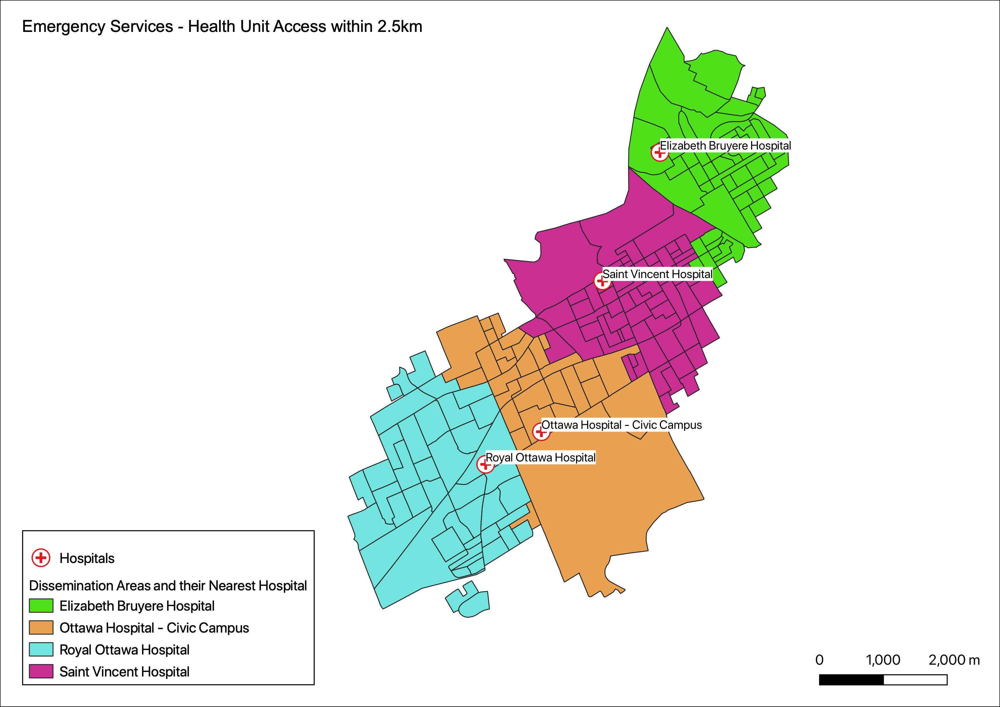

**Figure 7**. Ottawa DAs Mapped to their Nearest Hospital


*Possible Use Case*
1. During a pandemic, we don't want to overwhelm hospitals. 
   - Only allow patients into a hospital if they're from a specific ONS polygon
      - Number of accepted ONS polygons for a hospital could be based on population, number of buildings, etc.

Come up with resulting model 

Any house that emits a call

Can instead use QNEAT3 Distance Matrices "OD Matrix from layers as lines (m:n)". Fix CRS first

Another option is to use Network analysis tool service area from layer and then convex hull or concave hull with NN

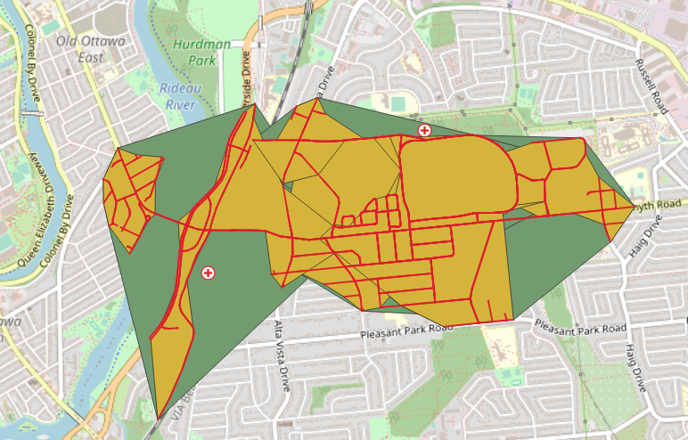

Limitations:
- The accuracy is left up to QGIS 
- We end up not serving houses that are on the same road
- Might have to expand the width ourselves

Might be better to do this in ArcGIS: 
https://desktop.arcgis.com/en/arcmap/latest/extensions/network-analyst/service-area.htm

Could also try Iso-Area as Polygons (from layer) but the projection should be in UTM zones instead: https://root676.github.io/

### Urban Logistics - Prescription Delivery Model

MAYBE MENTION HOW SHORTEST PATH CAN ALSO BE DONE IN RASTERS?

CAN ALSO USE SERVICE AREAS TO SHOW TIME INTERVALS OF TRAVEL https://desktop.arcgis.com/en/arcmap/latest/extensions/network-analyst/service-area.htm

A Canadian pharmacy chain, Shoppers Drug Mart, wants to launch a prescription delivery application. To save on costs and increase efficiencies, Shoppers is interested in delivering prescriptions to customers from the closest pharmacy. Before launching, Shoppers must first find willing participants to test the application. 

In Ottawa, Jonathan, a 24-year-old Carleton University student has recently tested positive for COVID-19 and must self-isolate for two weeks. He calls his local Shoppers to see if they can deliver his monthly prescribed medication. The pharmacist at Jonathan's local shoppers lets him know that they don't currently offer such services, but it is in their services pipeline. To avoid waiting for prescription delivery services to be available, the pharmacist asks Jonathan if he'd like to participate in beta testing their new prescription delivery application. Jonathan agrees and provides Shoppers with his consent to conduct research. 

Before creating a study area, Tim, a GIS Analyst working for Shoppers must first ask himself the following questions:

- Where is Jonathan located?
- What distance(s) are delivery drivers permitted to drive?
- Where are the Shoppers Drug Marts within the driveable distance?

To answer these questions, Tim will need to acquire current data specific to Ottawa like road networks, building footprints, and Shoppers locations. Once this data has been acquired, only then can he start extracting data to fit the extent of his study area. Using building footprints, Tim locates Jonathan's building, and sets a 2.5km buffer around it. Tim uses a spatial intersection tool to find that 3 local Shoppers Drug Marts are within this buffer. Then, he uses Ottawa's road network to find the shortest path between Jonathan's building and the 3 local Shoppers Drug Marts. With some basic SQL code, only the closest Shopper's Drug Mart to Jonathan's building is coupled. In this case, a delivery driver would be dispatched from the Merivale location to deliver Jonathan's prescribed medication (see **Figure 8**). 

The delivery service workflow generated for this model can be reincorporated to not only support prescription delivery for pharmacies, but also to link distribution centers to population centers, warehouses to stores, warehouses to stores to customers, etc. For the case of pharmacies, the Graphical Modeler in **Figure 9** automates the majority of the delivery service workflow. The final output would be the path to the closest pharmacy, which is what was seen in **Figure 8**. 

Going a step further, the workflow can be implemented on a much larger scale. Suppose Shoppers is ready to launch their application and would like to have every Shoppers Drug Mart deliver prescriptions to customers within a 2.5km distance buffer. Voronoi diagrams would allow analysts to identify the closest Shoppers to a customer's building. This can be done through creating Voronoi polygons from all the Shoppers Drug Mart point data with a large buffer extent and then clipping the Voronoi polygons with our specified 2.5km distance buffer (see **Figure 13**). Then we can use the Graphical Modeler as seen in **Figure 11** to find the shortest path between the closest Shoppers to a customer. 


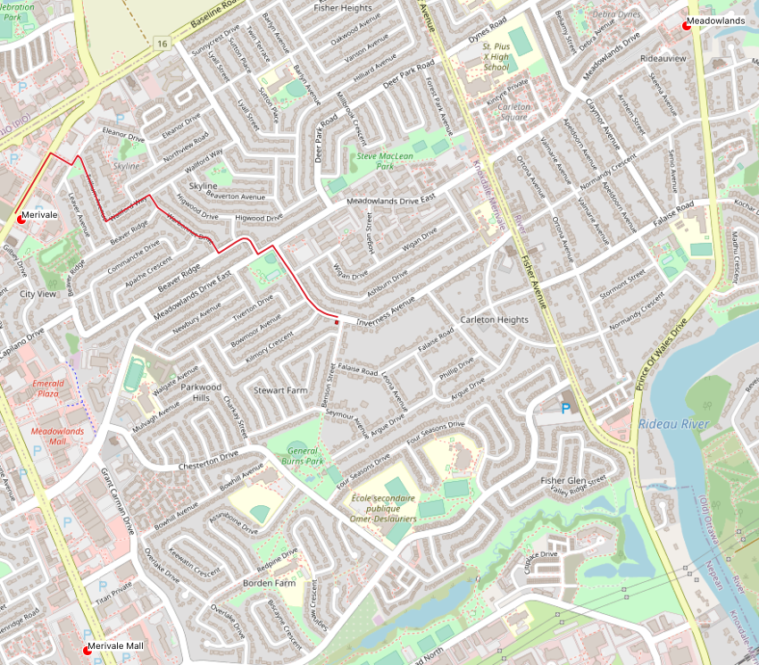

**Figure 8**. Closest Pharmacy 

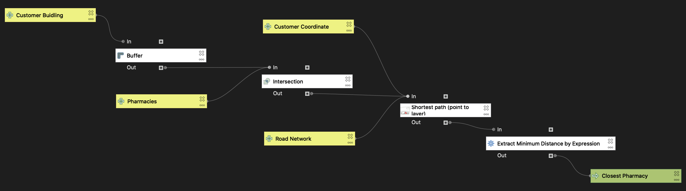

**Figure 9**. Closest Pharmacy Graphical Modeler 

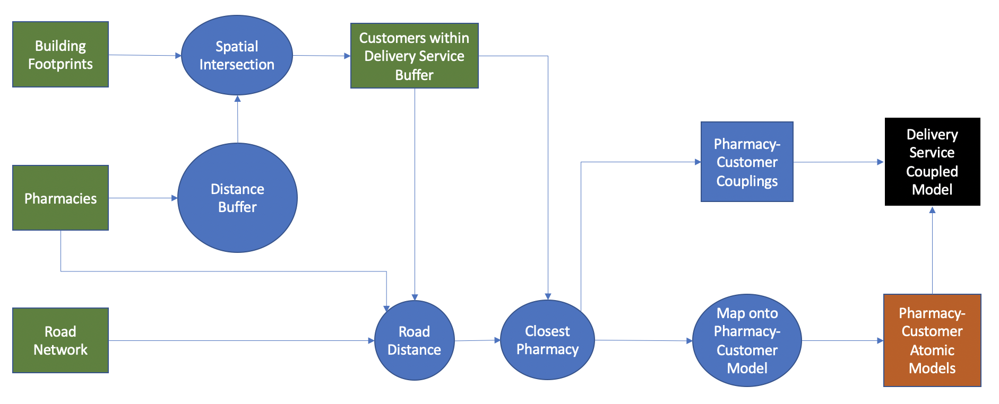

**Figure 10**. Delivery Service Model Generation Workflow

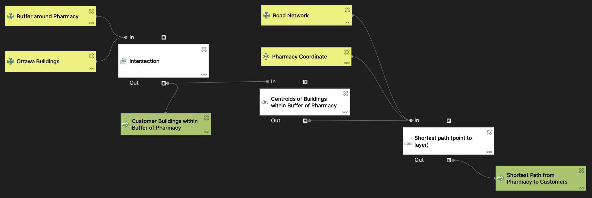

**Figure 11**. Graphical Modeler for Finding the Distance between Pharmacies and Customers

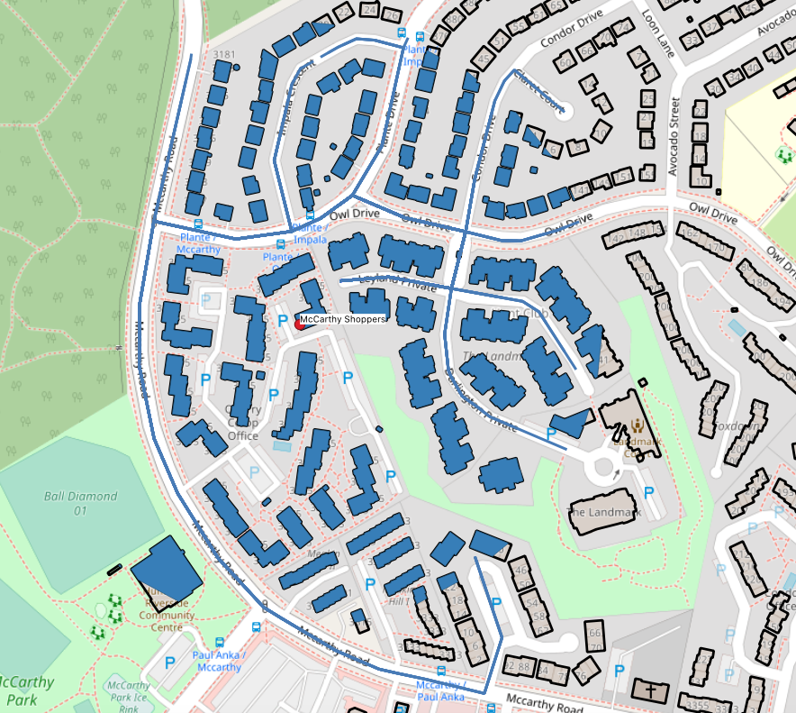

**Figure 12**. Buildings with Access to Prescription Delivery near McCarthy

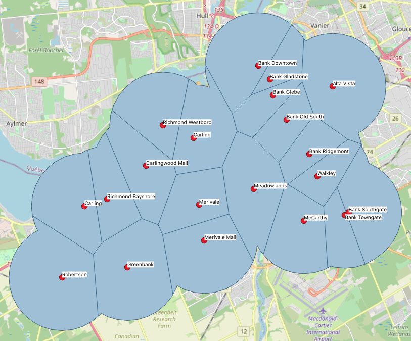

**Figure 13**. Large Scale Delivery

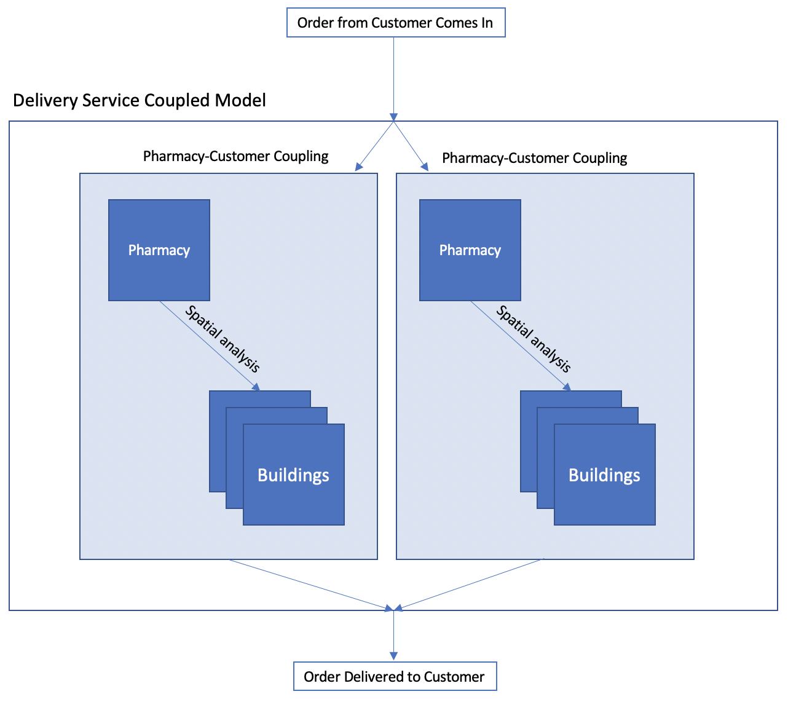

**Figure 14**. Delivery Service Coupled Model (maybe add ellipses so it looks like we have more couplings, e.g. coupling, coupling, ... , coupling)

### Disaster Response - Seasonal Floods

Make sure to change to a projected coordinate system before using buffers. For Ottawa, use UTM Zone 18N WGS 84. If we do not change the coordinate system, the buffer tool will assume degrees instead of distance. 

FIND A PUBLISHED MULTI-RING BUFFER EXAMPLE, NEED SOURCES

(Draft) As severe flooding increases across Canada due to climate change [ADD SOURCE HERE], proactive measures by various levels of governemtn is required. Without such intervention, flooding in regions like Ottawa-Gatineau will contiue to become a problem (ADD SOURCE HERE). Sandbags are commonly used as a defence against floods. Having data on which homes and neighbours to protect would be vital information. For example, assume a 1km flood risk buffer was created in one neighbourhood and then split into quarters via the multi-ring buffer method. Each ring in **Figure 16** can represent a sandbag line of defence so first responders can allot sandbags accordingly. The limitation for this model is that it does not take elevation into consideration. The speed and height at which water approaches a home is an important factor. The DAs surrounding the Wastewater Treatment Plant in Ottawa has a diverse amount of elevation. The severity of the flooding has been mapped using a three-ring buffer. Each ring in the three-ring buffer will represent 600m for a total of 1.8km. Also, the homes at the highest risk are those under 70m of elevation. To specify the amount of elevation in an area, Inverse Distance Weighting (IDW) with Nearest Neighbour (NN) Analysis is used to build a raster. Then we use the raster calculator to find which areas are below 70m of elevation. We then polygonize the raster and intersect it with the three-ring buffer. 

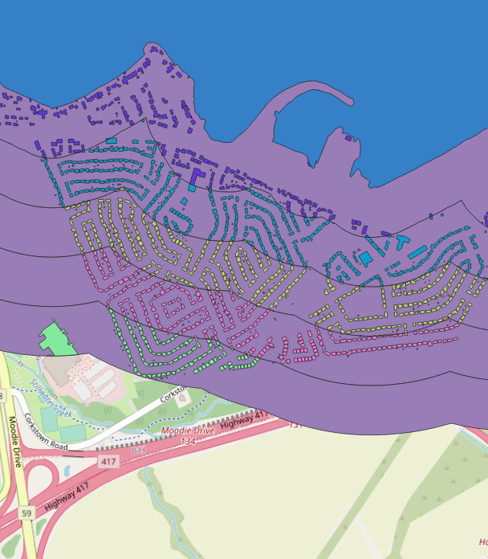

**Figure 16**. Buildings at Risk

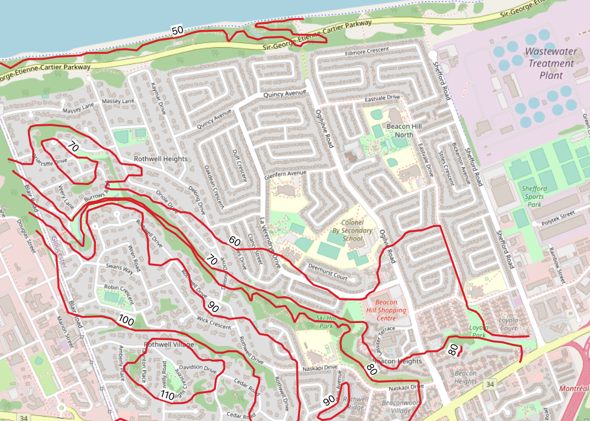

**Figure 18**. Elevation Contours 

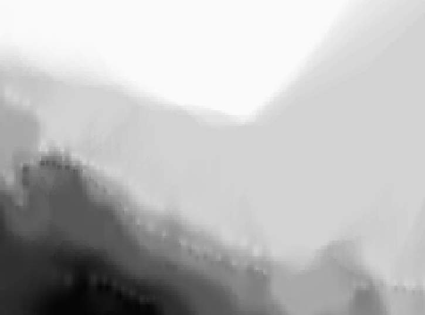

**Figure 19**. IDW with NN 


**Figure 20**. Raster Calculator Result (or add distance weight)

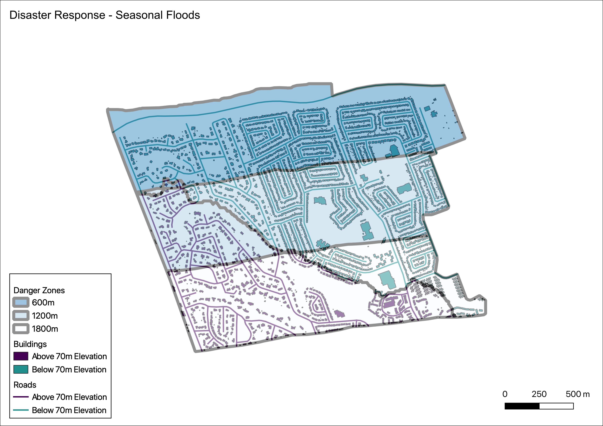

**Figure 21**. Buildings at Risk by Danger Zones and Elevations

## Scenarios

### Healthcare - Finding Polygons that Contain Hospitals

Ottawa resident, Mary, is looking for a new apartment to rent. She tells her Real Estate Agent that she would like to live within a boundary that has a hospital in it since she requires regular visits for post-op checkups. To meet Mary's apartment critieria, a spatial join (analysis) must be conducted. 

GIS analysts conduct spatial joins by taking one feature and seeing if it *intersects* with another feature. In this case, the GIS analyst would see if a hospital point is within an ONS polygon. This would allow us to define new neighbourhoods based on whether a polygon has a hospital or not. For this spatial join, we could also try one or more spatial relationship types like *touches, contains, within,* and *relation*. 

After analysis, Mary would receive results stating that she may look for apartments in the ten following areas: 
- Civic Hospital
- Central Park
- Billings Bridge 
- Alta Vista
- Riverview
- Wateridge Village
- Qualicum 
- Redwood Park
- West Centretown
- Byward Market


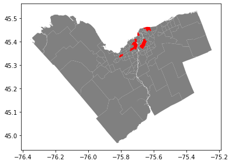

**Figure 1**. ONS polygons with Hospitals in them


### Disaster Response - Chemical Spill 

Following the Lac-Mégantic rail disaster, the Transport Safety Board (TSB) of Canada made a few recommendations to be better prepared to prevent similar disasters. One of the recommendations was to have "Emergency response assistance plans must be created when large volumes of liquid hydrocarbons, like oil, are shipped" ([TSB, 2019](https://www.tsb.gc.ca/eng/rapports-reports/rail/2013/r13d0054/r13d0054-r-es.html)). Help dispatch and evacuate people.

Ottawa's Montfort Hospital has had a chemical spill. Residents who are directly within 0.5km of the hospital are warned to evacuate immediately. Residents whose ONS Boundary touch with the 1.5km buffer are also expected to evacuated moments later. Before First Responders head into the polygons impacted by the chemical spill, they want to know how many buildings are impacted so that they may act by prioirity. This research would allow First Responders to know an approximate headcount as well. 

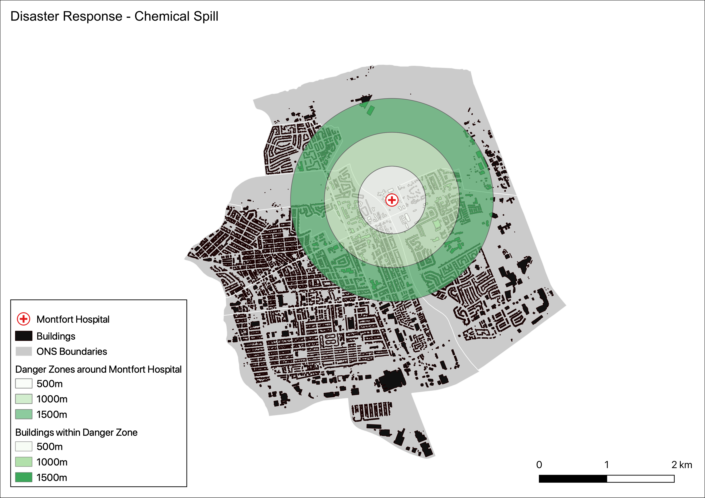

**Figure 9**. Overview of Chemical Spill Scenario

### Disaster Response - Power Outage

https://www.usbr.gov/power/edu/pamphlet.pdf

Hydroelectricity from the Hydro Ottawa Rideau Falls facility is capable of delivering power to consumers. Should an outage occur, a large number of buildings within ONS polygons that touch the 2km power outage buffer would be out of power. If such an event were to occur, the City of Ottawa would like to know which buildings are without power and which ONS polygon they reside in. 

Used 'Extract by location' instead of intersect to find polygons touching buffer


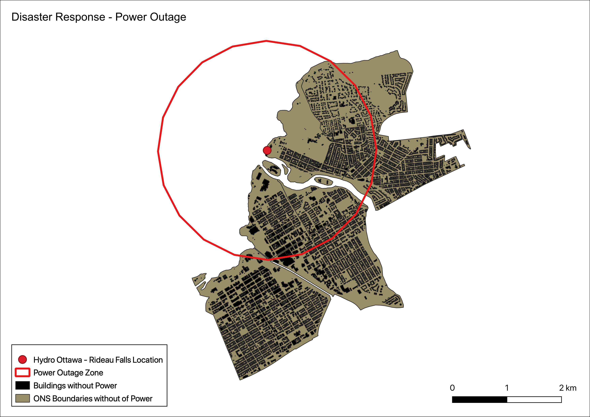

**Figure 12**. Ottawa DAs and Buildings Without Power


### Dealing with Populations - Classify Neighbourhoods by Population Density

At Statistics Canada, an intern would like to conduct a population density study using ONS data. The data gathered would be used for defining new neighbourhoods based on a simple quartile classification algorithm. 


**Figure 13**. ONS Population Density

**Legend**

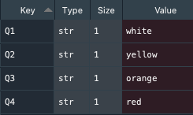

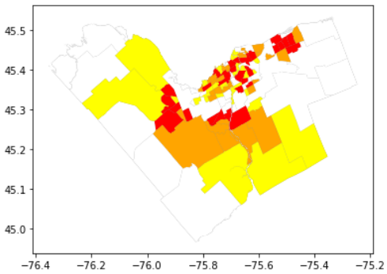

**Figure 14**. ONS Quartile Classification for New Neighbourhoods

*Potential Use Case*
1. Model highly infectious populations according to population density
   - We may theorize that more dense areas play an impact on the number of cases in neighbouring polygons. 
   - Expand to have topological relationships 
     - Maybe have buffers based on infection spread

### Transit - Finding the Nearest Bus Stop(s) to a Building 

JTFS

Find the nearest bus stop to each building within specific Ottawa DAs. This can be done by using bus stops to create voronoi polygons. Then, intersect the voronoi polygons with the Ottawa DAs. This scenario assumes that the vertices from each bus route are bus stops, even if that is not the case.  

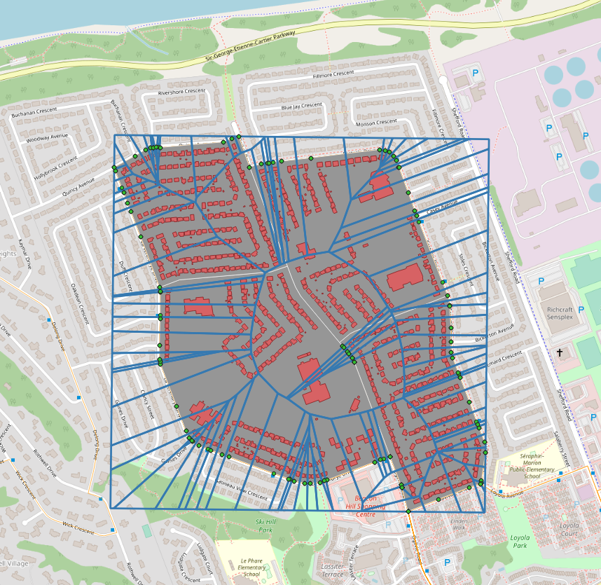

**Figure 17**. Overview of Closest Bus Stop(s) to each Building in DAs

### Travel - Fastest Route to the First Road Crossing in a List

We're in the center of Ottawa and want to find the shortest path to a road crossing through network analysis. 


**Figure 18**. Shortest path

### Spatial Weights - Proximity Analysis between Polygons

For the ONS dataset, we are looking for ways to represent the spatial relationships between polygons. We do this by depicting a spatial weight network (planar). In this case, the Queen contiguity weight lets us look at shared edges or vertices between polygons. 


**Figure 19**. Spatial Weight Network Ottawa

*Potential Use Case*
1. [Boundary Detection](https://geographicdata.science/book/notebooks/04_spatial_weights.html) to observe differences in wealth (Spatial Econometrics)
   - [Combining spatial statistics and spatial data analysis](http://resources.esri.com/help/9.3/arcgisengine/java/gp_toolref/spatial_statistics_toolbox/spatial_weights.htm)


## Credits and Acknowledgements

[Carleton University - ARSLab](https://arslab.sce.carleton.ca/) 

[Qiusheng Wu - Python Geospatial Repo on GitHub](https://github.com/giswqs/python-geospatial)

## Resources

### Notebooks

[Binder: ](https://mybinder.org/)Notebooks in an Executable Environment

[Jupyter Notebook: ](https://jupyter.org/)Interactive Python Notebooks

### Python Packages

[Matplotlib: ](https://matplotlib.org/)Visualization with Python

[Pandas: ](https://pandas.pydata.org)Data Analysis in Python

[GeoPandas: ](https://geopandas.org/)Work with Geospatial Data in Python

[Shapely: ](https://pypi.org/project/Shapely/)Manipulate and Analyze Geometric Objects

[NetworkX: ](https://networkx.github.io/)Network Analysis in Python

[OSMnx: ](https://github.com/gboeing/osmnx)Python for Street Networks

[PyProj: ](https://github.com/pyproj4/pyproj)For Projections in Geospatial Data

[PySal: ](https://pysal.org/)Spatial Analysis Library

[NumPy: ](https://numpy.org/)Scientific Computing with Python

[Descartes: ](https://pypi.org/project/descartes/)For Plotting Polygons in GeoPandas

[Geovoronoi:](https://github.com/WZBSocialScienceCenter/geovoronoi) For Plotting Voronoi Regions inside Geographic Regions

### Geospatial Analysis Program(s)

[GeoDa: ](https://geodacenter.github.io/)Spatial Data Analysis Program

[QGIS Download: ](https://www.qgis.org/en/site/)Open Source Geospatial Analysis Program

[QGIS Docs: ](https://www.qgistutorials.com/en/)Tutorials and Tips

### IDE

[Spyder: ](https://www.spyder-ide.org/)Scientific Python Development Environment


## Appendix 

### Dataset Sources

**[Ottawa Neighbourhood Study (ONS) from Carleton University](https://library.carleton.ca/find/gis/geospatial-data/ottawa-neighbourhoods)**

*Shapefile Location*

See [`/shapefiles/ONS`](https://github.com/omarkawach/spatial_analysis_scenarios/tree/master/shapefiles/ONS)


*Description from source:*
```
The ONS Neighbourhood Boundaries were created by the Ottawa Neighbourhood Study
(ONS) to analyse population statistics and are not indicative of actual 
neighbourhood limits.  Neighbourhood refers to an inhabited area delineated by 
social and physical boundaries. ONS neighbourhood boundaries were derived based on 
census tracts, physical and demographic similarities, physical barriers (e.g. 
waterways, highways, etc.), maps used by the real estate profession (e.g. the 
Ottawa Multiple Listing Service), consultations with community stakeholders, as 
well as fieldwork by ONS researchers.

108 neighbourhood boundaries are included in the shapefile, 
from Barrhaven to Woodvale. 
```

**[Hospitals from Open Ottawa](https://open.ottawa.ca/datasets/b769ce497f2540aa962e602c983994d6_0?geometry=-76.050%2C45.348%2C-75.396%2C45.433)**

*Shapefile Location*

See [`/shapefiles/OttawaHospitals`](https://github.com/omarkawach/spatial_analysis_scenarios/tree/master/shapefiles/OttawaHospitals)

*Description from source:*
```
Map containing point features of Hospitals located in the City of Ottawa.
```

**[Open Database of Building from Statistics Canada](https://www.statcan.gc.ca/eng/lode/databases/odb)**

*Shapefile Location*

See [`/shapefiles/OttawaBuildings.zip`](https://github.com/omarkawach/spatial_analysis_scenarios/tree/master/shapefiles/OttawaBuildings.zip)

*Description from source:*

```
The Open Database of Buildings (ODB) is a collection of open data on buildings,
primarily building footprints, and is made available under the Open Government 
License - Canada.
```

**[Ottawa Dissemination Areas (DA) from Open Ottawa](https://open.ottawa.ca/datasets/89fe8cb18d7345b2b666623ccb872310_0?geometry=-78.333%2C44.878%2C-73.101%2C45.555)**

*Shapefile Location*

See [`/shapefiles/OttawaDA`](https://github.com/omarkawach/spatial_analysis_scenarios/tree/master/shapefiles/OttawaDA)

*Description from source:*

```
The Dissemination Area Boundary Files portray the dissemination area boundaries
for which Census data are disseminated. A dissemination area is a small area
composed of one or more neighbouring dissemination blocks and is the smallest
standard geographic area for which all census data are disseminated.
```

**[OC Transpo Routes from Carleton University](https://library.carleton.ca/find/gis/geospatial-data/oc-transpo-transit-routes)**

*Shapefile Location*

See [`/shapefiles/OC_TRANSPO_ROUTES`](https://github.com/omarkawach/spatial_analysis_scenarios/tree/master/shapefiles/OC_TRANSPO_ROUTES)

*Modifications to Original Dataset in this Repo:*

The dataset came with hundreds of shapefiles. All the shapefiles were merged into one. 

*Description from source:*

```
Individual vector transit routes for OC Transpo between 1929 and 2015. 

The following information was collected for each transit route:
- Route Number
- Route Type (Regular, Peak, Express, Rural, etc.)
- Mode of Transportation (bus, train)
- Year
```


**[Road Network Files from Statistics Canada](https://www12.statcan.gc.ca/census-recensement/2011/geo/RNF-FRR/index-eng.cfm)**

*Shapefile Location*

See [`/shapefiles/OttawaRoads`](https://github.com/omarkawach/spatial_analysis_scenarios/tree/master/shapefiles/OttawaRoads)

*Modifications to Original Dataset in this Repo:*

The dataset came with the whole road network of Canada. Modified the dataset to only have Ottawa's road network. 

*Description from source:*

```
Road network files are digital representations of Canada's
national road network, containing information such as street
names, types, directions and address ranges.
```

**[Waterbody Data from Rideau Value Conservation Authority (RVCA)](https://rvcagis.github.io/jkan/)**

*Description from Source*

https://rvcagis.github.io/jkan/datasets/rvca-waterbodies/

```
RVCA Waterbodies represent the Lakes, Ponds and large Rivers within the RVCA, as a
polygon feature class. They have been delineated using the MNRF LIO waterbody standard
and using the existing LIO Waterbody layer as a base. This dataset is used extensively
for Subwatershed & Catchment Reporting, as well as Regulations
```


### Scenario Files and Packages