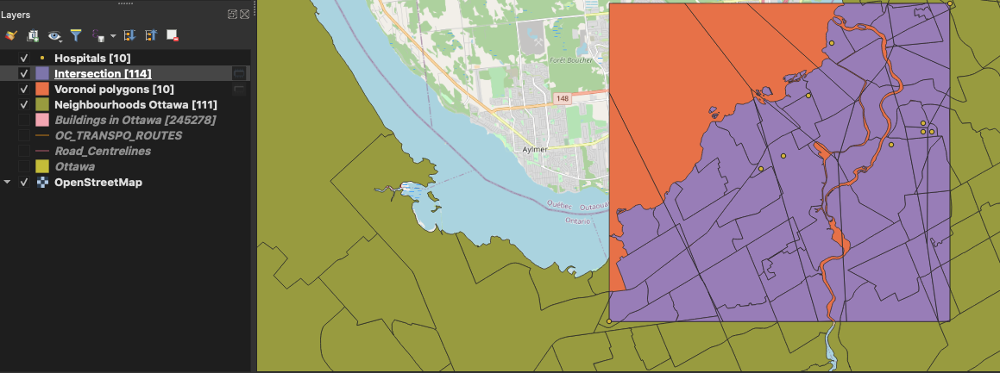
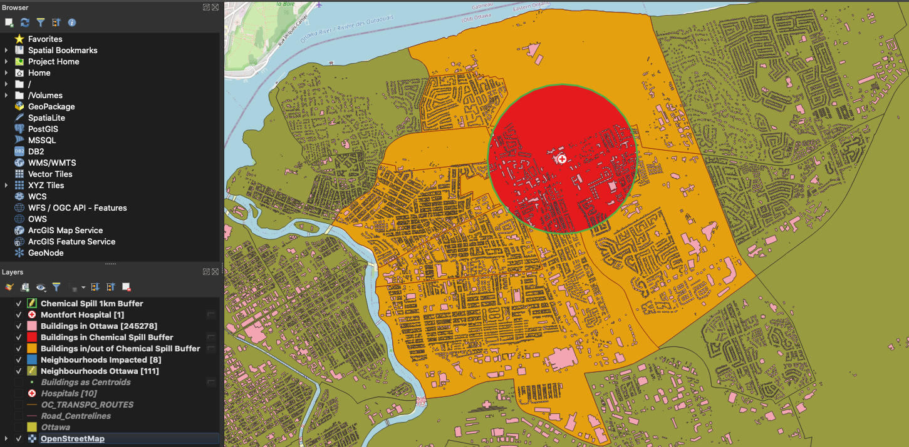
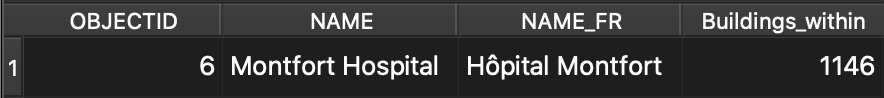
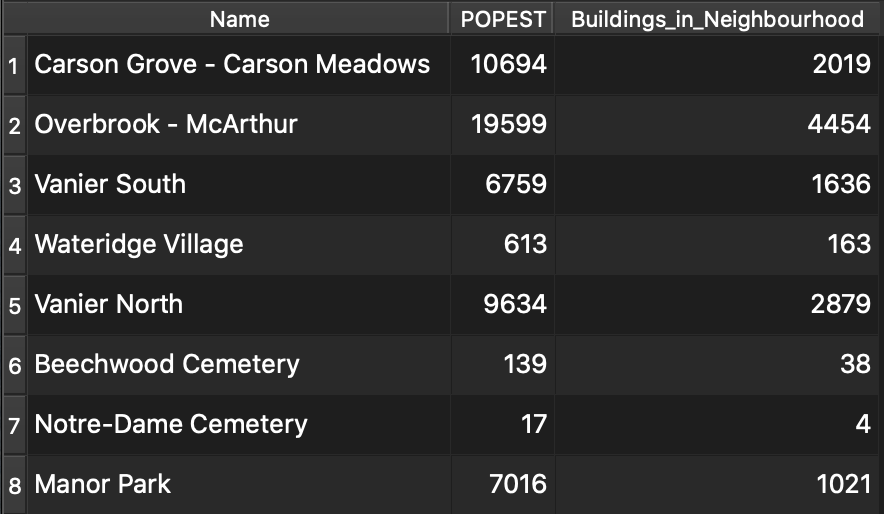
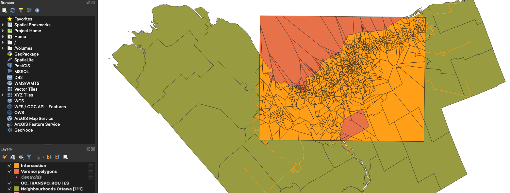

# Spatial Analysis Scenarios

This repository explores various open sources tools one could use for performing geospatial analysis. There are interactive **Jupyter Notebooks** available for demo purposes via **Binder**. Developers can also install Python packages themselves and run the code on their own in **Spyder**. 

## Users

[](https://mybinder.org/v2/gh/omarkawach/spatial_analysis_scenarios.git/master)

Steps:
- Click the icon above to launch this repository in Jupyter Notebook
- Once Binder loads the repo in Jupyter Notebook, Select the `scenario_notebooks` folder
- Select any notebook to demo
- Set kernel to Python 3
- Click `Run` to move down one cell
  - Keep clicking `Run` to move down another cell

**Note:** Some cells may need more than a few seconds or minutes to run. 

## Developers
1. In a console, cd into your desired directory and run the following:
   
   `git clone https://github.com/omarkawach/spatial_analysis_scenarios.git`
   
2. [Download Anaconda and then launch Spyder](https://www.anaconda.com/products/individual)
   

3. Open a console where you cloned the repo, install all necessary python packages in one go using:
   
   ` pip install --use-feature=2020-resolver -r packages.txt `

4. You may now run/manipulate code


## Scenarios

### 1st Scenario
Mary requires regular visits to the hospitals, and is looking for a new apartment to rent. 
Mary would like her apartment to be located in a neighbourhood with a hospital in it. 

```
Packages:
    - GeoPandas: To read shapefiles
    - Matplotlib: To plot data
Shapefiles: 
    - Ottawa Hospitals
    - Ottawa Neighbourhoods
```


**Figure 1**. 10 Neighbourhoods with Hospitals in them

```
Result of where Mary can look for a new apartment:
- Civic Hospital-Central Park
- Billings Bridge - Alta Vista
- Riverview
- Wateridge Village
- Qualicum - Redwood Park
- West Centretown
- Byward Market
```

### 2nd Scenario
911 Operator Joseph needs to know which hospitals are closest to a caller's neighbourhood. 
Joseph will dispatch an ambulance from the nearest hospital.

```
Packages:
    - GeoPandas: To read shapefiles
    - Matplotlib: To plot data
    - Shapely: To create GeoSeries' for calculating distances 
    - PyProj - To change the espg of shapefiles
Shapefiles: 
    - Ottawa Hospitals
    - Ottawa Neighbourhoods
```

**Legend**


**Figure 2**. Neighbourhoods with the closest hospital 

**NOTE**: The large blue region is Ottawa's greenbelt. It's center is far from Queensway-Carleton Hospital. 

### 3rd Scenario
For some recent we're in the center of Ottawa and want to find the shortest path to a road crossing. 

```
Packages:
    - GeoPandas: To create GeoDataFrames
    - PyProj: To change the espg of GeoDataFrames
    - Pandas: Convert dictionary to a Panda Series
    - OSMnx: For graphing and statistics
    - NetworkX: To calculate the shortest path
```


**Figure 3**. Shortest path

### 4th Scenario
Perhaps for some weird QA purpose we wanted to check if all the neighbourhoods are connected. 
We could depict a spatial weight network (planar) to confirm things are in order. 

```
Packages:
    - GeoPandas: To read shapefiles
    - PySal: To calculate and plot spatial weights
Shapefiles: 
    - Ottawa Neighbourhoods
```


**Figure 4**. Spatial Weight Network Ottawa

### 5th Scenario
John is doing a study and population density in Ottawa's many neighbourhoods. 
He loads his shapefile and can now sort it to only hold geometry and population estimates. 

```
Packages:
    - GeoPandas: To read shapefiles
    - Matplotlib: To plot data
    - NumPy: To help with classification
Shapefiles: 
    - Ottawa Neighbourhoods
```


**Figure 4**. Population Density in Ottawa's Neighbourhoods

What John does with the data afterwards is up to him. 
For example, he could define new neighbourhoods based on certain classification algorithms.

**Legend**


**Figure 5**. Ottawa Neighbourhoods Quartile Classification

### 6th Scenario
Let's say you have a bunch of neighbourhoods and hospitals as point data. You could build voronoi regions using the hospitals, then intersect them with neighbourhoods to identify all the neighbourhoods closest to each hospital. 

```
Shapefiles: 
    - Ottawa Neighbourhoods
    - Ottawa Hospitals
```



**Figure 6**. Ottawa Neighbourhoods Closest to Hospitals


**Figure 7**. Peview of Attribute Table for Sixth Scenario 

### 7th Scenario

The Montfort Hospital has had a chemical spill. Residents whose neighbourhood boundary intersect within 1km of the hospital are warned to evacuate. Intersected neighbourhoods are merged together into one shapefile to identify the number of impacted buildings. Could go further and include neighbourhoods that are touching impacted neighbourhoods.

```
Shapefiles: 
    - Ottawa Hospitals
    - Ottawa Buildings
    - Ottawa Neighbourhoods
Tools:
    - MMQGIS Plugin is convenient for creating buffers
```



**Figure 8**. Overview of Chemical Spill Scenario



**Figure 9**. Number of Buildings directly Impacted within Buffer



**Figure 10**. Number of Buildings Impacted in each Neighbourhood


### 8th Scenario

Find the center of each bus route, and use these centroids to create voronoi polygons. Then, intersect the voronoi polygons with the Ottawa Neighbourhoods. This will help us find the nearest neighbourhood to each route.

```
Shapefiles: 
    - OC Transpo Bus Routes
    - Ottawa Neighbourhoods
```



**Figure 8**. Overview of Closest Nieghbourhoods Scenario


## Resources

### Notebooks

[Binder: ](https://mybinder.org/)Notebooks in an Executable Environment

[Jupyter Notebook: ](https://jupyter.org/)Interactive Python Notebooks

### Python Packages

[Matplotlib: ](https://matplotlib.org/)Visualization with Python

[Pandas: ](https://pandas.pydata.org)Data Analysis in Python

[GeoPandas: ](https://geopandas.org/)Work with Geospatial Data in Python

[Shapely: ](https://pypi.org/project/Shapely/)Manipulate and Analyze Geometric Objects

[NetworkX: ](https://networkx.github.io/)Network Analysis in Python

[OSMnx: ](https://github.com/gboeing/osmnx)Python for Street Networks

[PyProj: ](https://github.com/pyproj4/pyproj)For Projections in Geospatial Data

[PySal: ](https://pysal.org/)Spatial Analysis Library

[NumPy: ](https://numpy.org/)Scientific Computing with Python

[Descartes: ](https://pypi.org/project/descartes/)For Plotting Polygons in GeoPandas

### Geospatial Analysis Program(s)

[QGIS Download: ](https://www.qgis.org/en/site/)Open Source Geospatial Analysis Program

[QGIS Docs](https://www.qgistutorials.com/en/): Tutorials and Tips

### IDE

[Spyder: ](https://www.spyder-ide.org/)Scientific Python Development Environment


