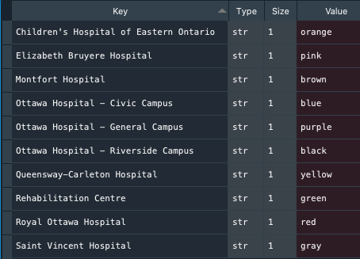
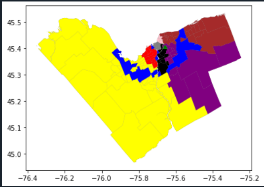
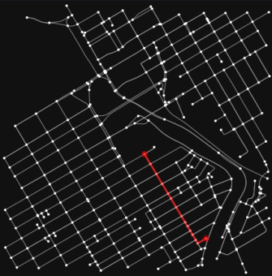
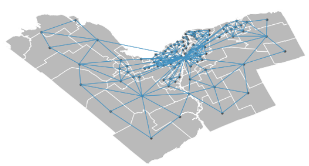
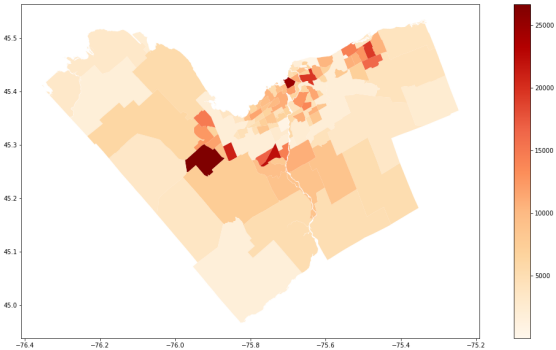

# Spatial Analysis Scenarios

This repository explores various open sources tools one could use for performing geospatial analysis. There are interactive **Jupyter Notebooks** available for demo purposes via Binder. Developers can also install Python packages themselves and run the code on their own in Spyder. 

## Users

[](https://mybinder.org/v2/gh/omarkawach/spatial_analysis_scenarios.git/master)

Steps:
- Click the icon above to launch this repository in Jupyter Notebook
- Once Binder loads the repo in Jupyter Notebook, Select the `scenario_notebooks` folder
- Select any notebook to demo
- Set kernel to Python 3
- Click `Run` to move down one cell
  - Keep clicking `Run` to move down another cell

**Note:** Some cells may need more than a few seconds or minutes to run. 

## Developers
1. In a console, cd into your desired directory and run the following:
   
   `git clone https://github.com/omarkawach/spatial_analysis_scenarios.git`
   
2. [Download Anaconda and then launch Spyder](https://www.anaconda.com/products/individual)
   

3. Open a console where you cloned the repo, install all necessary python packages in one go using ` pip install --use-feature=2020-resolver -r packages.txt `

4. You may now run/manipulate code


## Scenarios

#### First Scenario
Mary requires regular visits to the hospitals, and is looking for a new apartment to rent. 
Mary would like her apartment to be located in a neighbourhood with a hospital in it. 


**Figure 1**. 10 Neighbourhoods with Hospitals in them

```
Where Mary can look for a new apartment:
- Civic Hospital-Central Park
- Billings Bridge - Alta Vista
- Riverview
- Wateridge Village
- Qualicum - Redwood Park
- West Centretown
- Byward Market
```

#### Second Scenario
911 Operator Joseph needs to know which hospitals are closest to a caller's neighbourhood. 
Joseph will dispatch an ambulance from the nearest hospital.

**Legend**





**Figure 2**. Neighbourhoods with the closest hospital 

**NOTE**: The large blue region is Ottawa's greenbelt. It's center is far from Queensway-Carleton Hospital. 

#### Third Scenario
For some recent we're in the center of Ottawa and want to find the shortest path to a road crossing. 



**Figure 3**. Shortest path

#### Four Scenario
Perhaps for some weird QA purpose we wanted to check if all the neighbourhoods are connected. 
We could depict a spatial weight network (planar) to confirm things are in order. 



**Figure 4**. Spatial Weight Network Ottawa

#### Fifth Scenario
John is doing a study and population density in Ottawa's many neighbourhoods. 
He loads his shapefile and can now sort it to only hold geometry and population estimates. 



**Figure 4**. Population Density in Ottawa's Neighbourhoods

What John does with the data afterwards is up to him. 
For example, he could define new neighbourhoods based on certain classification algorithms.

**Legend**


**Figure 5**. Ottawa Neighbourhoods Quartile Classification

## Resources

#### Notebooks

[Binder: Notebooks in an Executable Environment](https://mybinder.org/)

[Jupyter Notebook](https://jupyter.org/)

#### Python Packages

[Matplotlib: ](https://matplotlib.org/)Visualization with Python

[GeoPandas: ](https://geopandas.org/)Work with Geospatial Data in Python

[Shapely: ](https://pypi.org/project/Shapely/)Manipulate and Analyze Geometric Objects

[NetworkX: ](https://networkx.github.io/)Network Analysis in Python

[OSMnx: ](https://github.com/gboeing/osmnx)Python for Street Networks

[PyProj: ](https://github.com/pyproj4/pyproj)For Projections in Geospatial Data

[PySal: ](https://pysal.org/)Spatial Analysis Library

[NumPy: ](https://numpy.org/)Scientific Computing with Python

[Descartes: ](https://pypi.org/project/descartes/)For Plotting Polygons in GeoPandas

#### Geospatial Analysis Program(s)

[QGIS](https://www.qgis.org/en/site/)

[QGIS Tutorials](https://www.qgistutorials.com/en/)

#### IDE

[Spyder: ](https://www.spyder-ide.org/)Scientific Python Development Environment


